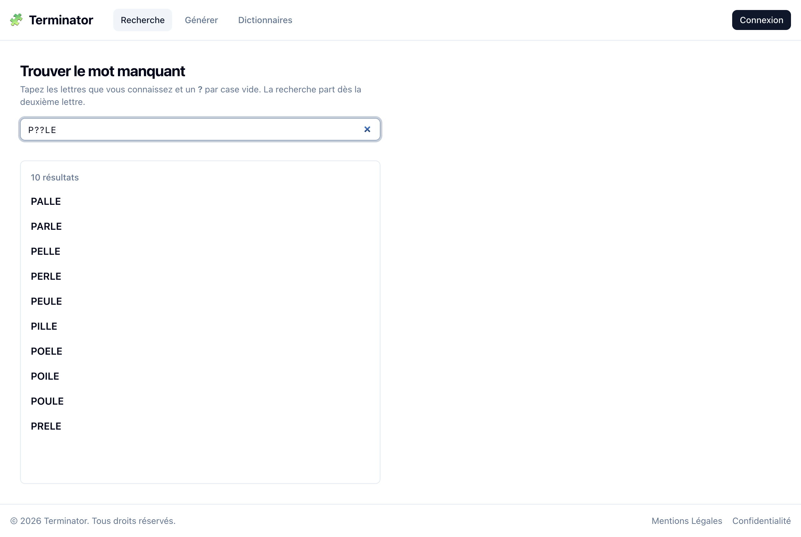

# 🧩 Terminator

[](https://github.com/maximefd/terminator-app/actions/workflows/ci.yml)

**Terminator est un outil de création de mots fléchés.** Il aide à fabriquer des grilles au rendu professionnel français, de deux façons :

- **à la main** : il vous manque un mot de 5 lettres qui commence par P et finit par LE ? La **recherche par motif** (`P??LE`) le trouve dans un dictionnaire de plus de 700 000 mots et dans vos dictionnaires personnels ;
- **automatiquement** : choisissez un format de grille, et le **moteur de génération** remplit toute la grille avec des mots qui se croisent correctement.

Ce n'est pas un jeu : c'est l'atelier d'un auteur de mots fléchés. Le projet est aujourd'hui un outil personnel, pensé dès le départ pour pouvoir servir un jour à des créateurs professionnels.

## Aperçu

| Accueil | Recherche par motif | Génération automatique |
|---------|---------------------|------------------------|
|  |  |  |

Captures régénérées par `cd frontend && pnpm exec playwright test tests/screenshots.spec.ts`, avec l'API et le frontend démarrés.

## Fonctionnalités

| Fonctionnalité | État |
|----------------|------|
| Recherche par motif (`?` = lettre inconnue) dans le dictionnaire commun | ✅ |
| Dictionnaires personnels (plusieurs, avec définitions) mêlés à la recherche | ✅ |
| Comptes utilisateurs (inscription, connexion, suppression des données) | ✅ |
| Génération automatique d'une grille à partir d'un layout | ✅ 20/20 sur les 16 layouts, du 6×7 au 13×16 ([détails](docs/ENGINE.md)) |
| Dictionnaire nettoyé des mots rares | 🚧 Phase 1 |
| Éditeur de layouts pour recopier les grilles de magazines ([détails](docs/LAYOUTS.md)) | ✅ ; catalogue à enrichir |
| Mots imposés et dictionnaires thématiques dans la génération | ✅ ; la difficulté est annoncée avant de générer ([ADR 0009](docs/adr/0009-annoncer-la-difficulte.md)) |
| Sauvegarde et historique des grilles | 🔜 Phase 4 |
| Flèches, définitions, export PDF | 🔜 Phase 5 |

Détail et calendrier : **[roadmap](docs/ROADMAP.md)**.

## Démarrage rapide

**Prérequis** : [Docker Desktop](https://www.docker.com/products/docker-desktop/), [Node.js 22](https://nodejs.org/), [pnpm](https://pnpm.io/installation), `make`.

```bash
git clone https://github.com/maximefd/terminator-app.git
cd terminator-app
make setup
```

`make setup` crée `.env` depuis `.env.example` et installe le frontend. Remplacez ensuite les secrets dans `.env`.

Lancer l'API (http://localhost:5001) et la base PostgreSQL :

```bash
make dev-api
```

Le premier démarrage charge tout le dictionnaire en mémoire (une à deux minutes). Puis, dans un autre terminal, lancer le frontend :

```bash
make dev-front
```

Ouvrez **http://localhost:3000** : la page d'accueil présente les trois usages, l'onglet **Recherche** trouve un mot par motif et **Générer** remplit une grille entière.

## Commandes utiles

| Commande | Rôle |
|----------|------|
| `make help` | Liste des commandes |
| `make test` | Tests backend + lint et types frontend |
| `make bench` | Benchmark du moteur de génération |

## Structure du dépôt

```text
terminator-app/
├── backend/                 API Flask (Python 3.11)
│   ├── app.py, routes.py, auth.py   Application, endpoints, authentification
│   ├── schemas.py, security.py      Validation des entrées, sécurité transverse
│   ├── trie_engine.py               Dictionnaire en mémoire et recherche par motif
│   ├── grid_generator.py, engine/   Moteur de génération de grilles
│   ├── layouts/                     Layouts de grilles (<largeur>x<hauteur>/<NNN>.txt)
│   ├── benchmarks/, test_harness.py Benchmark reproductible du moteur
│   └── tests/                       Tests pytest
├── frontend/                Application Next.js 15 (React, Tailwind, shadcn/ui)
├── docs/                    Documentation (architecture, moteur, sécurité, ADR…)
├── docker-compose.yml       API + PostgreSQL pour le développement
└── Makefile                 Commandes courantes
```

## Documentation

| Document | Contenu |
|----------|---------|
| [Roadmap](docs/ROADMAP.md) | Où en est le projet, prochaines phases |
| [PRD](docs/PRD.md) | Vision produit, personas, critères de succès |
| [Architecture](docs/ARCHITECTURE.md) | Composants, endpoints, modèle de données, authentification |
| [Moteur](docs/ENGINE.md) | Comment une grille est remplie, heuristiques, benchmark, limites |
| [Layouts](docs/LAYOUTS.md) | Format des mises en page, ajout d'un layout |
| [Lexique](docs/LEXICON.md) | Dictionnaire DELA et projet de curation |
| [Sécurité](docs/SECURITY.md) | Modèle de menace, mesures, limites connues |
| [Décisions (ADR)](docs/adr/) | Choix d'architecture et leurs raisons |
| [Contribuer](CONTRIBUTING.md) | Installation, tests, conventions, processus de PR |
| [Changelog](CHANGELOG.md) | Historique des versions |

## État du projet

- Version **0.1.0** : génération réparée et testée, socle de sécurité, benchmark reproductible.
- Pas de déploiement en ligne pour l'instant : tout tourne en local ([ADR 0004](docs/adr/0004-pas-de-deploiement-en-ligne.md)).
- En cours : Phase 0c (documentation et GitHub), puis curation du lexique et catalogue de layouts.

## Contribuer

Les issues sont organisées par phase dans les [milestones](https://github.com/maximefd/terminator-app/milestones). Voir [CONTRIBUTING.md](CONTRIBUTING.md) avant d'ouvrir une PR. Pour une faille de sécurité, voir [SECURITY.md](docs/SECURITY.md) (pas d'issue publique).

## Licence

Aucune licence open source n'est accordée pour l'instant : tous droits réservés.
