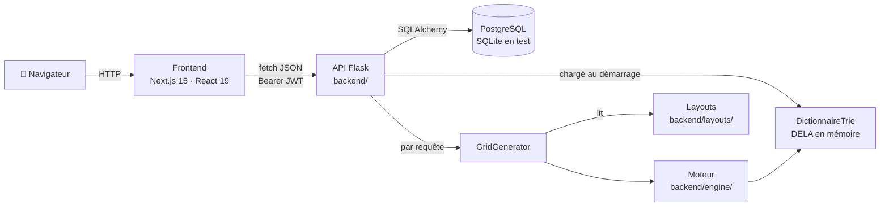
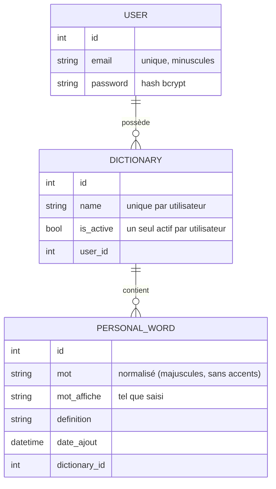
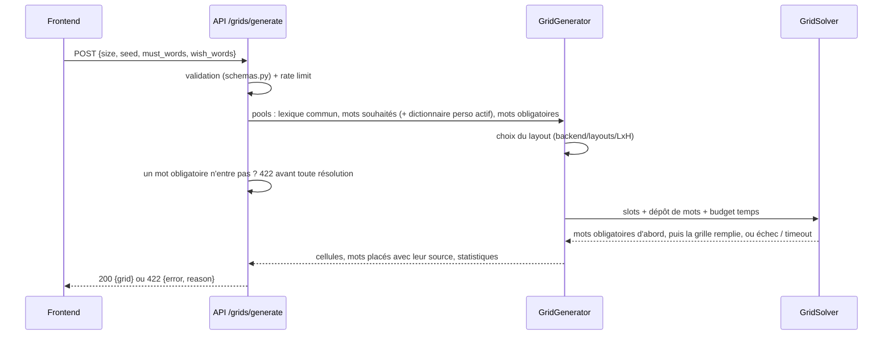

# 🏗️ Architecture — Terminator

> Vue d'ensemble technique : comment les morceaux s'assemblent. Pour le moteur de génération en détail, voir [ENGINE.md](ENGINE.md) ; pour la sécurité, [SECURITY.md](SECURITY.md).

## Vue d'ensemble

Terminator est un monorepo en deux applications :

- **`frontend/`** — application web Next.js (ce que voit l'utilisateur) ;
- **`backend/`** — API REST Flask : comptes, dictionnaires personnels, recherche par motif et génération de grilles.

Il n'y a **pas de déploiement en ligne** pour l'instant : tout tourne en local (voir [ADR 0004](adr/0004-pas-de-deploiement-en-ligne.md)).

---

## Backend (`backend/`)

**Stack** : Python 3.11, Flask 3, Flask-SQLAlchemy, Flask-JWT-Extended, Flask-Bcrypt, Flask-Limiter, pydantic.

| Module | Rôle |
|--------|------|
| `app.py` | Fabrique `create_app()` : configuration (variables d'environnement), CORS, extensions, sécurité, blueprints, chargement du dictionnaire |
| `run.py` | Point d'entrée (`python run.py`) |
| `auth.py` | Blueprint `/api/auth` : inscription, connexion, renouvellement du jeton |
| `routes.py` | Blueprint `/api` : dictionnaires, mots, recherche, formats, génération, suppression de compte |
| `schemas.py` | Schémas pydantic de chaque corps de requête + messages d'erreur en français |
| `security.py` | Gestionnaires d'erreurs JSON, en-têtes HTTP, callbacks JWT, rate limiting |
| `models.py` / `extensions.py` | Modèles SQLAlchemy et instances des extensions |
| `trie_engine.py` | `DictionnaireTrie` : normalisation des mots et recherche par motif (`P??LE`) |
| `grid_generator.py` | Chef d'orchestre de la génération (choix du layout, dépôt de mots, solveur) |
| `engine/` | Moteur de génération, sans dépendance Flask (voir [ENGINE.md](ENGINE.md)) |
| `layouts/<L>x<H>/<NNN>.txt` + `convert_layouts.py` | Layouts de grilles et conversion de l'ancien format (voir [LAYOUTS.md](LAYOUTS.md)) |
| `layout_catalog.py` + `check_layouts.py` | Catalogue des layouts (lecture, vérification, enregistrement sans écrasement) et sa vérification en ligne de commande |
| `test_harness.py` + `benchmarks/` | Benchmark reproductible du générateur |
| `tests/` | Tests pytest (API, sécurité, moteur) |

### Endpoints

| Méthode | Route | Auth | Rôle |
|---------|-------|------|------|
| GET | `/api/status` | — | Santé de l'API, dictionnaire chargé |
| POST | `/api/auth/register` | — | Inscription (renvoie les jetons) |
| POST | `/api/auth/login` | — | Connexion |
| POST | `/api/auth/refresh` | refresh token | Nouveau jeton d'accès |
| GET / POST | `/api/dictionaries` | ✅ | Lister (crée un dictionnaire par défaut) / créer |
| PATCH / DELETE | `/api/dictionaries/<id>` | ✅ | Renommer, activer / supprimer |
| GET / POST | `/api/dictionaries/<id>/words` | ✅ | Lister / ajouter un mot |
| DELETE | `/api/dictionaries/<id>/words/<word_id>` | ✅ | Supprimer un mot |
| POST | `/api/search` | optionnelle | Recherche par motif (DELA + dictionnaire personnel actif) |
| GET | `/api/grids/formats` | — | Formats de grille disponibles |
| GET | `/api/layouts` | — | Catalogue des layouts : grilles et statistiques par format |
| POST | `/api/grids/difficulty` | — | Ce que coûtent des mots imposés, **sans générer** ([ADR 0009](adr/0009-annoncer-la-difficulte.md)) |
| POST | `/api/grids/generate` | optionnelle | Génère une grille remplie (`must_words`, `wish_words`, `wish_dictionary_ids`, dictionnaire personnel actif) |
| DELETE | `/api/users/me` | ✅ | Supprime le compte et toutes ses données |

Les erreurs sont toujours du JSON `{"error": "message en français"}` (plus `details` pour la validation).

### Modèle de données

Le **dictionnaire commun (DELA)** n'est pas en base : il est lu depuis `backend/dela_clean.csv` et chargé en mémoire au démarrage de l'API (voir [LEXICON.md](LEXICON.md)). Les tables sont créées par `db.create_all()` au démarrage (pas encore de migrations : Phase 4).

### Parcours d'une génération

---

## Frontend (`frontend/`)

**Stack** : Next.js 15 (App Router), React 19, TypeScript, Tailwind CSS 4, shadcn/ui, TanStack React Query, pnpm.

| Chemin | Rôle |
|--------|------|
| `src/app/page.tsx` | Accueil : ce qu'est Terminator, ses trois usages, mode invité |
| `src/app/search/page.tsx` | Recherche par motif (+ panneau des dictionnaires si connecté) |
| `src/app/dictionaries/page.tsx` | Dictionnaires personnels en pleine page |
| `src/app/grid/page.tsx` | Génération : mots obligatoires et souhaités, difficulté annoncée, grille produite |
| `src/app/login`, `register` | Authentification |
| `src/app/legal`, `privacy` | Mentions légales, confidentialité |
| `src/components/` | Composants (recherche, dictionnaires, grille, layout, `ui/` = shadcn) |
| `src/contexts/auth-context.tsx` | État de connexion, écoute de l'expiration de session |
| `src/lib/api-client.ts` | `apiFetch` : jeton, renouvellement automatique sur 401, messages d'erreur de l'API |
| `src/lib/utils.ts` | `getApiBaseUrl()` : `NEXT_PUBLIC_API_BASE_URL`, sinon `http://localhost:5001` en local |
| `next.config.ts` | En-têtes de sécurité (CSP...) |
| `tests/` | Tests end-to-end Playwright |

### Authentification

1. `register` / `login` renvoient un **access token** (15 min) et un **refresh token** (7 jours), stockés dans `localStorage`.
2. `apiFetch` envoie `Authorization: Bearer <access>`.
3. Sur un 401, il appelle une fois `/api/auth/refresh`, rejoue la requête, et sinon efface la session et prévient le contexte d'authentification.

Choix et limites : [ADR 0003](adr/0003-jwt-en-en-tete.md), [SECURITY.md](SECURITY.md).

---

## Environnements et configuration

| Environnement | Comment | Base de données |
|---------------|---------|-----------------|
| Développement | `docker compose up` (API + PostgreSQL) et `pnpm dev` (frontend) | PostgreSQL (conteneur `db`) |
| Tests | `pytest` | SQLite en mémoire, dictionnaire de test réduit |
| Production | Pas encore (Phase 6) | — |

Toute la configuration passe par des variables d'environnement, documentées dans [`.env.example`](../.env.example).

## Qualité

- **CI GitHub Actions** (`.github/workflows/ci.yml`) sur chaque PR vers `main` : tests backend, lint + types + build frontend.
- **Benchmark** du moteur : `backend/benchmarks/` (à relancer pour toute modification du moteur).
- **Dependabot** : mises à jour hebdomadaires des dépendances.
- **Décisions** : [docs/adr/](adr/).
