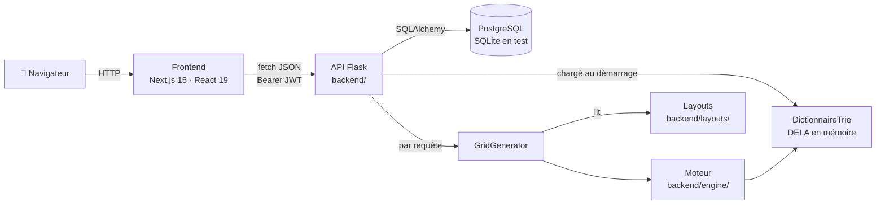
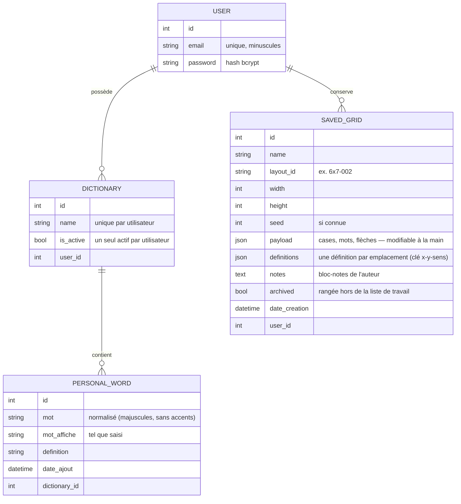
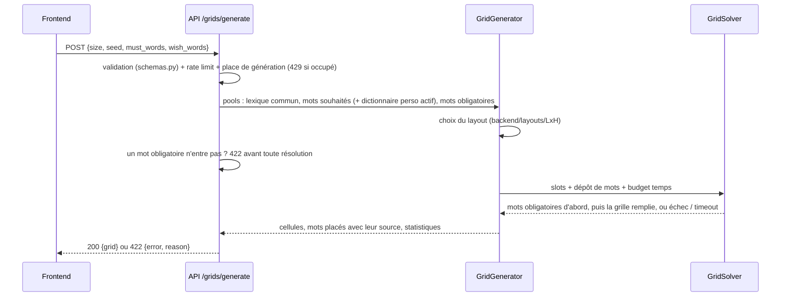

# 🏗️ Architecture — Terminator

> Vue d'ensemble technique : comment les morceaux s'assemblent. Pour le moteur de génération en détail, voir [ENGINE.md](ENGINE.md) ; pour la sécurité, [SECURITY.md](SECURITY.md).

## Vue d'ensemble

Terminator est un monorepo en deux applications :

- **`frontend/`** — application web Next.js (ce que voit l'utilisateur) ;
- **`backend/`** — API REST Flask : comptes, dictionnaires personnels, recherche par motif et génération de grilles.

Il n'y a **pas de déploiement en ligne** pour l'instant : tout tourne en local (voir [ADR 0004](adr/0004-pas-de-deploiement-en-ligne.md)).

---

## Backend (`backend/`)

**Stack** : Python 3.11, Flask 3, Flask-SQLAlchemy, Flask-JWT-Extended, Flask-Bcrypt, Flask-Limiter, pydantic.

| Module | Rôle |
|--------|------|
| `app.py` | Fabrique `create_app()` : configuration (variables d'environnement), CORS, extensions, sécurité, blueprints, chargement du dictionnaire |
| `run.py` | Point d'entrée : `python run.py` en développement, `run:app` sous gunicorn en production |
| `gunicorn.conf.py` | Serveur de production : 3 workers synchrones, application chargée une fois avant de les créer ([ADR 0013](adr/0013-cible-hebergement-production.md)) |
| `auth.py` | Blueprint `/api/auth` : inscription, connexion, renouvellement du jeton, mot de passe oublié, confirmation de l'adresse |
| `monitoring.py` | Suivi des erreurs (Sentry), inactif sans `SENTRY_DSN` ; rien d'identifiant dans les rapports |
| `account_links.py`, `mailer.py` | Liens signés envoyés par e-mail, et leur envoi (journal, SMTP ou mémoire) ([ADR 0014](adr/0014-emails-du-compte.md)) |
| `routes.py` | Blueprint `/api` : dictionnaires, mots, recherche, formats, génération, suppression de compte |
| `schemas.py` | Schémas pydantic de chaque corps de requête + messages d'erreur en français |
| `security.py` | Gestionnaires d'erreurs JSON, en-têtes HTTP, callbacks JWT, rate limiting, adresse du visiteur (`client_ip`) |
| `generation_slots.py` | Places de génération : au plus 2 générations à la fois, une par visiteur (verrous de fichiers partagés entre workers) |
| `models.py` / `extensions.py` | Modèles SQLAlchemy et instances des extensions |
| `trie_engine.py` | `DictionnaireTrie` : normalisation des mots et recherche par motif (`P??LE`) |
| `grid_generator.py` | Chef d'orchestre de la génération (choix du layout, dépôt de mots, solveur) |
| `engine/` | Moteur de génération, sans dépendance Flask (voir [ENGINE.md](ENGINE.md)) |
| `layouts/<L>x<H>/<NNN>.txt` + `convert_layouts.py` | Layouts de grilles et conversion de l'ancien format (voir [LAYOUTS.md](LAYOUTS.md)) |
| `layout_catalog.py` + `check_layouts.py` | Catalogue des layouts (lecture, vérification, enregistrement sans écrasement) et sa vérification en ligne de commande |
| `test_harness.py` + `benchmarks/` | Benchmark reproductible du générateur |
| `tests/` | Tests pytest (API, sécurité, moteur) |

### Endpoints

| Méthode | Route | Auth | Rôle |
|---------|-------|------|------|
| GET | `/api/status` | — | Santé de l'API, dictionnaire chargé |
| POST | `/api/auth/register` | — | Inscription ; ouvre la session (cookies) |
| POST | `/api/auth/login` | — | Connexion ; ouvre la session (cookies) |
| POST | `/api/auth/logout` | cookie de refresh | Révoque les jetons de la session et efface les cookies |
| POST | `/api/auth/refresh` | cookie de refresh | Nouveau jeton d'accès (cookie) |
| POST | `/api/auth/password/forgot` | — | Envoie un lien pour changer de mot de passe ; même réponse que le compte existe ou non ([ADR 0014](adr/0014-emails-du-compte.md)) |
| POST | `/api/auth/password/reset` | lien | Nouveau mot de passe (`{token, password}`) ; le lien ne sert qu'une fois, une heure |
| POST | `/api/auth/email/verify` | lien | Confirme l'adresse (`{token}`) |
| POST | `/api/auth/email/resend` | ✅ | Renvoie le lien de confirmation |
| GET / POST | `/api/dictionaries` | ✅ | Lister (crée un dictionnaire par défaut) / créer |
| PATCH / DELETE | `/api/dictionaries/<id>` | ✅ | Renommer, activer / supprimer |
| GET / POST | `/api/dictionaries/<id>/words` | ✅ | Lister / ajouter un mot |
| DELETE | `/api/dictionaries/<id>/words/<word_id>` | ✅ | Supprimer un mot |
| POST | `/api/search` | optionnelle | Recherche par motif (DELA + dictionnaire personnel actif) |
| GET | `/api/grids/formats` | — | Formats de grille disponibles |
| GET | `/api/layouts` | — | Catalogue des layouts : grilles et statistiques par format |
| POST | `/api/grids/difficulty` | — | Ce que coûtent des mots imposés, **sans générer** ([ADR 0009](adr/0009-annoncer-la-difficulte.md)) |
| POST | `/api/grids/generate` | optionnelle | Génère une grille remplie, flèches comprises (`clues`) : `must_words`, `wish_words`, et les seuls dictionnaires demandés ([ADR 0011](adr/0011-dictionnaires-choisis.md)) |
| GET / POST | `/api/grids` | ✅ | Lister ses grilles conservées (résumés ; `?archived=true|false`) / en conserver une |
| GET / DELETE | `/api/grids/<id>` | ✅ | Relire une grille conservée (cases, flèches, définitions) / la supprimer |
| PATCH | `/api/grids/<id>` | ✅ | Définitions, notes, archivage, renommage — et **lettres corrigées à la main** (`cells`), qui font recalculer les mots ([ADR 0012](adr/0012-grille-modifiable.md)) |
| POST | `/api/grids/<id>/suggestions` | ✅ | Les mots qui entrent à un emplacement **sans casser ses croisements** |
| GET | `/api/users/me` | ✅ | L'adresse e-mail du compte et ce qu'il contient (dictionnaires, mots, grilles) |
| DELETE | `/api/users/me` | ✅ | Supprime le compte et toutes ses données ; `{password}` redemandé (403 s'il est faux) |

Les erreurs sont toujours du JSON `{"error": "message en français"}` (plus `details` pour la validation).

### Modèle de données

Le **dictionnaire commun (DELA)** n'est pas en base : il est lu depuis `backend/dela_clean.csv` et chargé en mémoire au démarrage de l'API (voir [LEXICON.md](LEXICON.md)).

Le schéma évolue par **migrations Alembic** (`backend/migrations/`, [ADR 0010](adr/0010-migrations-de-schema.md)) : l'API applique les révisions en attente au démarrage, et `db.create_all()` ne subsiste que pour les tests. Une grille conservée garde son contenu en JSON plutôt que ses paramètres : le lexique est curé au fil des semaines, la même seed ne redonnerait pas la même grille plus tard. Et depuis l'[ADR 0012](adr/0012-grille-modifiable.md), elle n'est plus le procès-verbal d'une génération mais un **document** : l'auteur y corrige des lettres, et les mots se recalculent à partir de la grille — les emplacements, eux, ne bougent jamais.

### Parcours d'une génération

---

## Frontend (`frontend/`)

**Stack** : Next.js 15 (App Router), React 19, TypeScript, Tailwind CSS 4, shadcn/ui, TanStack React Query, pnpm.

| Chemin | Rôle |
|--------|------|
| `src/app/page.tsx` | Accueil : ce qu'est Terminator, ses trois usages, mode invité |
| `src/app/search/page.tsx` | Recherche par motif (+ panneau des dictionnaires si connecté) |
| `src/app/dictionaries/page.tsx` | Dictionnaires personnels en pleine page |
| `src/app/grids/` | Grilles conservées : recherche, filtres, archivage |
| `src/app/grids/edit/` | L'éditeur, `/grids/edit?id=12` : définitions, correction des lettres, notes, export PDF. L'identifiant passe en paramètre : un export statique ne génère pas une page par grille |
| `security-headers.mjs`, `scripts/write-headers.mjs` | En-têtes de sécurité (CSP…) : envoyés par `next dev`, écrits dans `out/_headers` pour Cloudflare Pages au build ; chaque page reçoit en plus une CSP en `<meta>` qui n'autorise que ses scripts inline, par empreinte (#99) |
| `src/app/grid/page.tsx` | Génération : mots obligatoires et souhaités, difficulté annoncée, grille produite |
| `src/app/login`, `register` | Authentification |
| `src/app/account/` | Mon compte : l'adresse, ce que le compte contient, sa suppression |
| `src/app/legal`, `privacy` | Mentions légales (crédits compris), confidentialité : ce qui est conservé, et rien d'autre |
| `src/components/` | Composants (recherche, dictionnaires, grille, layout, `ui/` = shadcn) |
| `src/contexts/auth-context.tsx` | État de connexion, écoute de l'expiration de session |
| `src/lib/api-client.ts` | `apiFetch` : cookies de session et jeton CSRF, renouvellement automatique sur 401, messages d'erreur de l'API |
| `src/lib/utils.ts` | `getApiBaseUrl()` : `NEXT_PUBLIC_API_BASE_URL`, sinon `http://localhost:5001` en local |
| `next.config.ts` | Export statique au build (`out/`), en-têtes de sécurité en dev ; refuse un build sans `NEXT_PUBLIC_API_BASE_URL` |
| `tests/` | Tests end-to-end Playwright |

### Authentification

1. `register` / `login` posent un **access token** (15 min) et un **refresh token** (7 jours) en cookies `httpOnly` : le JavaScript de la page ne les voit jamais. Deux cookies lisibles les accompagnent, `csrf_access_token` et `csrf_refresh_token`.
2. `apiFetch` envoie les cookies (`credentials: "include"`) et recopie le jeton CSRF dans `X-CSRF-TOKEN` pour chaque écriture.
3. Sur un 401, il appelle une fois `/api/auth/refresh`, rejoue la requête, et sinon ferme la session (`/api/auth/logout`) et prévient le contexte d'authentification.
4. La déconnexion révoque les jetons ; un changement de mot de passe ferme toutes les sessions.
5. En développement, sans `NEXT_PUBLIC_API_BASE_URL`, `next dev` relaie `/api/*` vers l'API locale (`API_PROXY_TARGET`, défaut `http://localhost:5001`) : même origine partout, y compris par le tunnel de `make preview-remote`.

Choix et limites : [ADR 0015](adr/0015-session-en-cookies.md) (qui remplace l'[ADR 0003](adr/0003-jwt-en-en-tete.md)), [SECURITY.md](SECURITY.md).

---

## Environnements et configuration

| Environnement | Comment | Base de données |
|---------------|---------|-----------------|
| Développement | `docker compose up` (API + PostgreSQL) et `pnpm dev` (frontend) | PostgreSQL (conteneur `db`) |
| Tests | `pytest` | SQLite en mémoire, dictionnaire de test réduit |
| Production | Pas encore. Cible : un VPS derrière Cloudflare, API sous gunicorn ([ADR 0013](adr/0013-cible-hebergement-production.md)) | PostgreSQL sur le VPS |

Toute la configuration passe par des variables d'environnement, documentées dans [`.env.example`](../.env.example).

## Qualité

- **CI GitHub Actions** (`.github/workflows/ci.yml`) sur chaque PR vers `main` : tests backend, lint + types + build frontend.
- **Benchmark** du moteur : `backend/benchmarks/` (à relancer pour toute modification du moteur).
- **Dependabot** : mises à jour hebdomadaires des dépendances.
- **Décisions** : [docs/adr/](adr/).
