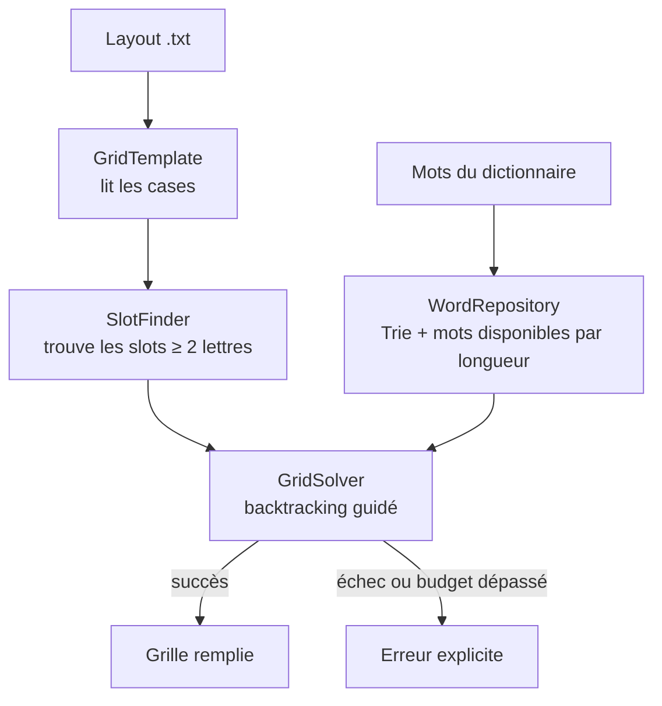

# ⚙️ Moteur de génération — Terminator

> Comment Terminator remplit automatiquement une grille, en langage simple. Code : `backend/grid_generator.py` et `backend/engine/`.

## Le problème

On part d'une **mise en page** (layout) : un rectangle de cases, certaines réservées aux définitions (cases « noires »), les autres destinées à recevoir des lettres. Il faut écrire un mot dans chaque emplacement horizontal et vertical, de sorte que **tous les croisements soient cohérents** et que **chaque mot existe** dans le dictionnaire. C'est un problème de satisfaction de contraintes : on le résout par une recherche avec retour arrière (*backtracking*), guidée par des heuristiques.

## Vocabulaire

| Terme | Sens |
|-------|------|
| **Layout** | Mise en page d'une grille (fichier `backend/layouts/<L>x<H>/<NNN>.txt`, voir [LAYOUTS.md](LAYOUTS.md)) |
| **Case définition** | Case `x` du layout : ne reçoit pas de lettre |
| **Slot** | Emplacement d'un mot : suite d'au moins 2 cases lettres, horizontale (`across`) ou verticale (`down`) |
| **Motif** | État actuel d'un slot, `?` pour une case vide (ex : `P??LE`) |
| **Candidat** | Mot du dictionnaire qui correspond au motif et n'est pas déjà utilisé dans la grille |

## Les étapes



1. **`GridTemplate`** lit le layout avec `layout_format.py` : `x` = case définition, `-` = case lettre (ancien format `#` / `.` accepté). Un caractère inconnu ou une taille différente de celle du dossier est une erreur.
2. **`SlotFinder`** repère tous les slots horizontaux et verticaux d'au moins 2 lettres.
3. **`WordRepository`** répond à « quels mots disponibles correspondent à ce motif ? » grâce à un **index par (position, lettre)** (`pattern_index.py`) : pour chaque longueur, l'ensemble des mots ayant telle lettre à telle position est un ensemble de bits (un entier Python). Les candidats de `P??LE` sont le ET binaire des ensembles « P en 1 », « L en 4 », « E en 5 » et des mots encore disponibles ; les compter ne demande qu'un `bit_count()`. L'index est construit une fois par lexique chargé et partagé entre les générations. Un mot placé est retiré des mots disponibles : **pas de doublon dans une grille**. Les mots viennent de trois **pools** — obligatoires, souhaités (dictionnaires personnels et thématiques), communs (lexique curé) : ceux qui ne sont pas dans le lexique sont ajoutés à l'index de leur longueur et acceptés aux croisements (#17, [ADR 0007](adr/0007-contrat-de-generation.md)).
4. **`GridSolver`** remplit la grille :
   - il choisit le **slot le plus contraint** ;
   - il essaie ses meilleurs candidats un par un ;
   - il vérifie que le mot ne rend aucun croisement impossible ;
   - il descend récursivement, et revient en arrière en cas d'impasse.
5. **`GridGenerator`** orchestre le tout et formate le résultat (cellules, mots placés, statistiques).

## Les heuristiques du solveur

| Heuristique | Idée | Réglage |
|-------------|------|---------|
| **MRV amélioré** (*Minimum Remaining Values*) | Traiter d'abord le slot avec le moins de candidats par croisement : `score = nb_candidats / (1 + nb_intersections)` | — |
| **Mots obligatoires d'abord** | Placer les mots imposés avant tout le reste, en commençant par celui qui a le moins d'emplacements possibles (échouer vite plutôt qu'après avoir rempli la moitié de la grille), avec retour arrière | `_place_a_must_word` |
| **Pools de mots** | Essayer d'abord les mots de l'auteur : obligatoires, puis souhaités, puis le lexique commun. Le pool passe avant le score, donc un mot souhaité survit à la limite de candidats | `POOL_PRIORITY` (`word_repository.py`) |
| **Score des mots** | Préférer les mots faits de lettres fréquentes (E, A, S, R…), qui laissent plus de possibilités aux croisements | `LETTER_SCORES` |
| **Limite de candidats** | N'essayer que les 300 meilleurs candidats d'un slot. Mesuré : 100 ou 300 donnent 420/420, mais 300 est plus rapide (médiane 0,91 s → 0,71 s, p95 du 13×18 de 14,6 s à 8,7 s) ; 500 n'apporte rien | `MAX_CANDIDATES_PER_SLOT = 300` |
| **Fréquence des mots** | Trier les candidats par fréquence donne des mots plus courants (mots absents des corpus : 33 % → 17 % des mots placés) mais **ferme la recherche** : sept layouts tombent sous 20/20. Désactivé par défaut, activable par requête (`frequency_mode`) | `FREQUENCY_MODE = "none"` |
| **Variété** | Mélanger aléatoirement le top 20 % des candidats, pour ne pas produire toujours la même grille | générateur aléatoire seedé |
| **Validation croisée** | Un mot est refusé s'il forme, dans l'autre sens, un mot **terminé** qui n'existe pas. Une suite de lettres encore ouverte (« AB » au milieu d'un emplacement de 5 cases) n'est qu'un mot en cours d'écriture : elle n'est pas vérifiée | `_is_placement_valid` |
| **Forward checking** | Refuser un mot qui laisserait un slot croisé sans candidat de rechange. Exiger davantage paraît prudent mais interdit les clôtures de fin de grille (#61) | `MIN_SAFE_CANDIDATES = 2` (minimum imposé par l'invariant) |
| **Nogoods** | Mémoriser les motifs sans aucun mot pour ne pas les recréer | invalidés au retour arrière |
| **Changement de layout** | Quand des mots sont imposés et qu'un format est demandé, passer au layout suivant du format une fois la recherche **épuisée** sur le courant. Mesuré (#73) : la géométrie décide bien plus que la trajectoire — mais en changer à chaque essai détruit les redémarrages et fait perdre des grilles | `_layouts`, `_layout_index` |
| **Redémarrages** | Plusieurs essais courts plutôt qu'un long : l'essai n°i s'arrête après `unité × luby(i)` appels récursifs (1, 1, 2, 1, 1, 2, 4…), puis repart avec une nouvelle trajectoire dérivée du seed, tant que le budget temps le permet. Les mots consommés par un essai interrompu sont rendus au dépôt | `DEFAULT_RESTART_UNIT_CALLS = 300` (`grid_generator.py`) |

## Garanties

- **Déterminisme** : même code + même dictionnaire + même seed ⇒ même grille. Chaque génération a son propre générateur aléatoire (aucun état global partagé).
- **Budget temps** : la résolution s'arrête au-delà de `GENERATION_TIME_BUDGET_S` (20 s par défaut) et l'API renvoie une erreur `422` avec `reason: "timeout"`. Une grille impossible renvoie `reason: "no_solution"`.
- **Mots obligatoires** : une grille n'est renvoyée que si **tous** sont placés. Un mot qui n'entre pas dans le layout est refusé **avant toute résolution** (`reason: "must_words"`, avec le problème mot par mot et des layouts où ils tiennent) ; un mot que la recherche n'a pas su placer donne `reason: "must_words_unplaced"` et la liste des mots restants.
- **Portabilité** : `backend/engine/` n'importe ni Flask ni la base de données. Il pourra un jour tourner côté client (voir [ADR 0002](adr/0002-moteur-pur-et-deterministe.md)).

## Mesurer : le benchmark

Toute modification du moteur doit être mesurée :

```bash
make bench
```

Résultats et méthode : [`backend/benchmarks/README.md`](../backend/benchmarks/README.md).

**Baseline actuelle** (20 seeds, budget 20 s, `dela_clean.csv`, **sans mot imposé**) :

Les **21 layouts du catalogue réussissent 20 fois sur 20** (420 générations, 420 réussites), du 6×7 (12 mots) au 13×18 (81 mots) :

| Format | Mots | p50 | p95 |
|--------|------|-----|-----|
| 6×7 (5 layouts) | 12-13 | 0,05 à 0,06 s | 0,10 à 0,19 s |
| 7×9 | 20 | 0,16 s | 0,44 s |
| 11×6 | 21 | 0,33 s | 1,09 s |
| 11×9 | 33 | 0,78 s | 3,32 s |
| 14×9 | 38 | 1,29 s | 3,41 s |
| 10×13 (6 layouts) | 41-43 | 0,47 à 0,84 s | 1,49 à 5,53 s |
| 11×17 (2 layouts) | 61-62 | 0,89 à 1,24 s | 3,44 à 3,67 s |
| 13×16 (3 layouts) | 61-64 | 0,79 à 2,51 s | 2,87 à 10,08 s |
| 13×18 | 81 | 2,19 s | 8,72 s |

Deux réserves sur ce tableau : il est mesuré sur le DELA brut, alors que l'API charge le lexique curé (qui donne 418/420, plus petit donc plus contraint) ; et **sans aucun mot imposé**, cas où le taux s'effondre (voir la limite ci-dessous).

Cinq changements ont mené là. Le 11×6 était « vite ou jamais » : les **redémarrages** exploitent ce profil (#19) et l'**index des candidats** rend chaque essai 2 à 6 fois plus rapide (#20). Surtout, les grilles de plus de 30 mots n'aboutissaient **jamais** à cause d'un bug de la validation croisée : les mots encore en cours d'écriture devaient déjà exister au dictionnaire (#57, voir `backend/benchmarks/README.md`). Enfin, le seuil du forward checking est passé de 3 à 2 : à 3, les grilles de plus de 60 mots arrivaient à deux mots de la fin sans pouvoir conclure (#61). Et le plafond de candidats est passé de 100 à 300, ce qui accélère sans rien changer au taux de succès.

## Limites connues

| Limite | Conséquence | Prévu |
|--------|-------------|-------|
| **Mots obligatoires** : c'est la **longueur** des mots qui décide. Trois mots de 6 lettres au plus réussissent 67 % du temps, contre 39 % sans plafond ; un seul mot imposé, 92 % | Un mot long ou portant une lettre rare (`TAQUINER`, `BIBLIOTHEQUES`) peut n'aboutir sur aucune grille | [#73](https://github.com/maximefd/terminator-app/issues/73). Les échecs sont surtout des mots **non placés**, pas des dépassements de budget : allonger le temps n'y changerait rien. Le changement de layout améliore le cas où le format compte plusieurs layouts, sans résoudre le fond |
| **Qualité des mots** : un tiers des mots placés sont absents de tout corpus | Grilles avec des formes rares | Le tri par fréquence les ramène à 17 %, mais fait échouer les grandes grilles : disponible par requête (`frequency_mode: "exact"`), pas par défaut. Le vrai levier reste la **curation du lexique** |
| Dictionnaire trop large (formes fléchies rares) | Grilles pleines de mots peu naturels | Phase 1 : lexique curé |
| Pas de flèches ni de définitions | Rendu « mots croisés » plutôt que « mots fléchés » | Phase 5 |
| Première génération après le chargement d'un lexique : construction de l'index (1,4 s sur le DELA complet, puis 0,3 s par génération) | Première génération un peu plus lente | Construire l'index au chargement du lexique si besoin |
