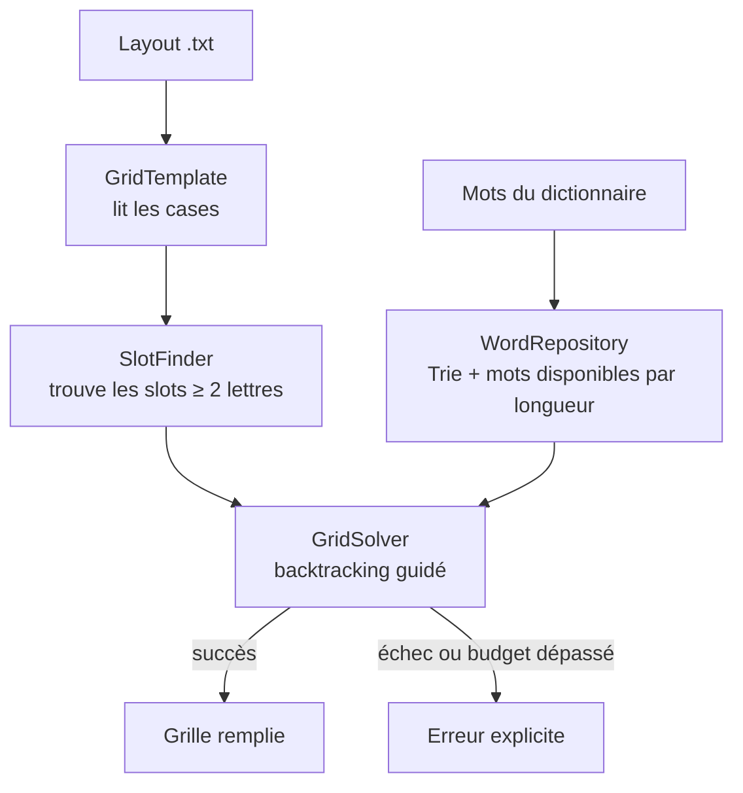

# ⚙️ Moteur de génération — Terminator

> Comment Terminator remplit automatiquement une grille, en langage simple. Code : `backend/grid_generator.py` et `backend/engine/`.

## Le problème

On part d'une **mise en page** (layout) : un rectangle de cases, certaines réservées aux définitions (cases « noires »), les autres destinées à recevoir des lettres. Il faut écrire un mot dans chaque emplacement horizontal et vertical, de sorte que **tous les croisements soient cohérents** et que **chaque mot existe** dans le dictionnaire. C'est un problème de satisfaction de contraintes : on le résout par une recherche avec retour arrière (*backtracking*), guidée par des heuristiques.

## Vocabulaire

| Terme | Sens |
|-------|------|
| **Layout** | Mise en page d'une grille (fichier `backend/layouts/<L>x<H>/<NNN>.txt`, voir [LAYOUTS.md](LAYOUTS.md)) |
| **Case définition** | Case `x` du layout : ne reçoit pas de lettre |
| **Slot** | Emplacement d'un mot : suite d'au moins 2 cases lettres, horizontale (`across`) ou verticale (`down`) |
| **Motif** | État actuel d'un slot, `?` pour une case vide (ex : `P??LE`) |
| **Candidat** | Mot du dictionnaire qui correspond au motif et n'est pas déjà utilisé dans la grille |

## Les étapes



1. **`GridTemplate`** lit le layout avec `layout_format.py` : `x` = case définition, `-` = case lettre (ancien format `#` / `.` accepté). Un caractère inconnu ou une taille différente de celle du dossier est une erreur.
2. **`SlotFinder`** repère tous les slots horizontaux et verticaux d'au moins 2 lettres.
3. **`WordRepository`** répond à « quels mots disponibles correspondent à ce motif ? » grâce au Trie (`trie_engine.py`), avec un cache des motifs déjà demandés. Un mot placé est retiré des mots disponibles : **pas de doublon dans une grille**.
4. **`GridSolver`** remplit la grille :
   - il choisit le **slot le plus contraint** ;
   - il essaie ses meilleurs candidats un par un ;
   - il vérifie que le mot ne rend aucun croisement impossible ;
   - il descend récursivement, et revient en arrière en cas d'impasse.
5. **`GridGenerator`** orchestre le tout et formate le résultat (cellules, mots placés, statistiques).

## Les heuristiques du solveur

| Heuristique | Idée | Réglage |
|-------------|------|---------|
| **MRV amélioré** (*Minimum Remaining Values*) | Traiter d'abord le slot avec le moins de candidats par croisement : `score = nb_candidats / (1 + nb_intersections)` | — |
| **Score des mots** | Préférer les mots faits de lettres fréquentes (E, A, S, R…), qui laissent plus de possibilités aux croisements | `LETTER_SCORES` |
| **Limite de candidats** | N'essayer que les 100 meilleurs candidats d'un slot | `MAX_CANDIDATES_PER_SLOT = 100` |
| **Variété** | Mélanger aléatoirement le top 20 % des candidats, pour ne pas produire toujours la même grille | générateur aléatoire seedé |
| **Validation croisée** | Un mot est refusé s'il forme un mot invalide dans l'autre sens | `_is_placement_valid` |
| **Forward checking strict** | Refuser un mot qui laisserait un slot croisé avec moins de 3 candidats | `MIN_SAFE_CANDIDATES = 3` (doit rester ≥ 2) |
| **Nogoods** | Mémoriser les motifs sans aucun mot pour ne pas les recréer | invalidés au retour arrière |

## Garanties

- **Déterminisme** : même code + même dictionnaire + même seed ⇒ même grille. Chaque génération a son propre générateur aléatoire (aucun état global partagé).
- **Budget temps** : la résolution s'arrête au-delà de `GENERATION_TIME_BUDGET_S` (20 s par défaut) et l'API renvoie une erreur `422` avec `reason: "timeout"`. Une grille impossible renvoie `reason: "no_solution"`.
- **Portabilité** : `backend/engine/` n'importe ni Flask ni la base de données. Il pourra un jour tourner côté client (voir [ADR 0002](adr/0002-moteur-pur-et-deterministe.md)).

## Mesurer : le benchmark

Toute modification du moteur doit être mesurée :

```bash
make bench
```

Résultats et méthode : [`backend/benchmarks/README.md`](../backend/benchmarks/README.md).

**Baseline actuelle** (20 seeds, budget 20 s) :

| Layout | Succès |
|--------|--------|
| 6×7 | 20/20 (médiane 0,3 s) |
| 11×6 | 3/20 |

Le 11×6 est « vite ou jamais » : les grilles réussies le sont en 3,6 à 15,7 s, les autres s'enlisent.

## Limites connues

| Limite | Conséquence | Prévu |
|--------|-------------|-------|
| Taux de succès faible sur les layouts difficiles (11×6 : 3/20) | Beaucoup de timeouts | Phase 3 : redémarrages aléatoires, index des candidats par (position, lettre) |
| **Les mots personnels ne sont jamais placés** : les candidats viennent uniquement du Trie DELA, qui ne contient pas les mots des dictionnaires personnels | Le dictionnaire personnel actif n'influence pas la grille | Phase 3 : pools de mots obligatoires / souhaités / communs |
| Dictionnaire trop large (formes fléchies rares) | Grilles pleines de mots peu naturels | Phase 1 : lexique curé |
| Pas de mots imposés | Impossible de forcer des mots | Phase 3 |
| Pas de flèches ni de définitions | Rendu « mots croisés » plutôt que « mots fléchés » | Phase 5 |
| Invalidation du cache par longueur à chaque placement | Travail répété | Phase 3 (guidé par le benchmark) |
