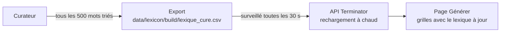

# 📚 Lexique — Terminator

> Le dictionnaire commun utilisé par la recherche et la génération : d'où il vient, comment il est chargé, et comment il va être nettoyé.

## Aujourd'hui : le DELA

- **Fichier** : `backend/dela_clean.csv` (~55 Mo, 980 292 lignes), dérivé du DELA (dictionnaire électronique des formes fléchies du français).
- **Colonnes** (séparateur `;`) : forme en majuscules ; forme affichée (avec accents) ; description (toujours « Forme fléchie de … », donc **pas de vraie définition**).
- **Normalisation** (`DictionnaireTrie._normalize`) : majuscules, accents retirés, seuls les caractères alphanumériques gardés (espaces, tirets et apostrophes supprimés), 2 lettres minimum.
- **Résultat** : **714 092 mots distincts**, dont ~393 000 de 11 lettres ou moins.
- **Chargement** : au démarrage de l'API, tout le fichier est inséré dans un Trie en mémoire (`app.dela_trie`). Cela prend du temps et beaucoup de RAM.

| Longueur | 2 | 3 | 4 | 5 | 6 | 7 | 8 | 9 | 10 | 11 |
|----------|---|---|---|---|---|---|---|---|----|----|
| Mots | 91 | 604 | 2 580 | 8 310 | 19 827 | 37 843 | 60 214 | 80 091 | 91 780 | 92 380 |

### Le problème

Le DELA contient **toutes les formes fléchies** : conjugaisons, pluriels, mots très rares. Les grilles générées se remplissent de mots peu naturels (« ELIERA », « AUNES »…). Or la qualité des mots est la priorité pour un auteur de mots fléchés. Un dictionnaire plus petit rendrait aussi le solveur plus rapide.

Les dictionnaires **personnels**, eux, sont en base de données (voir [ARCHITECTURE.md](ARCHITECTURE.md)).

## Le pipeline (Phase 1a)

Code : `tools/lexicon/` (Python, bibliothèque standard uniquement). Décision : [ADR 0005](adr/0005-pipeline-du-lexique-et-decisions.md).

```bash
make lexicon-download   # télécharge et vérifie les sources (~411 Mo, une seule fois)
make lexicon-build      # construit la base locale (plusieurs minutes)
make lexicon-stats      # avancement de la curation
make lexicon-export     # produit le lexique curé
```

### Sources

| Source | Apporte | Licence |
|--------|---------|---------|
| `backend/dela_clean.csv` | La liste de mots et leurs formes affichées | — |
| [Lexique 3.83](http://www.lexique.org) | Fréquence (films et livres), lemme, catégorie grammaticale | CC BY-SA 4.0 |
| [Wiktionnaire](https://fr.wiktionary.org), extrait [kaikki.org](https://kaikki.org/frwiktionary/) | Définitions ; une forme fléchie est expliquée par son lemme | CC BY-SA 4.0 |

Les fichiers téléchargés vont dans `data/lexicon/raw/` (non versionné). Leurs empreintes sont consignées dans `data/lexicon/sources.lock.json` (versionné), qui dit exactement quelles données ont servi. `make lexicon-download` refuse un fichier dont l'empreinte a changé ; `python -m tools.lexicon download --refresh` met la source à jour.

### La base locale

`data/lexicon/build/lexicon.sqlite` (non versionnée, reconstructible à tout moment). Un mot par forme normalisée :

| Colonne | Contenu |
|---------|---------|
| `norm` | Forme normalisée, celle des grilles (`ETE`) |
| `display_forms` | Formes affichées (`["été", "étê"]`) |
| `zipf` | Fréquence sur l'échelle zipf : 3 = 1 occurrence par million, 6 = 1 pour 1 000 ; 0 si absent de Lexique |
| `lemma`, `pos` | Lemme et catégorie de l'emploi le plus fréquent |
| `definition` | Première définition du Wiktionnaire, dans la catégorie grammaticale donnée par Lexique ; pour une forme fléchie, « forme de X — définition de X » |
| `definition_kind` | `own` (définition du mot lui-même), `inflection` (forme fléchie expliquée par son lemme) ou vide |
| `suggestion` | Aide à la décision, voir ci-dessous |

Les noms propres, préfixes, suffixes et sigles du Wiktionnaire sont ignorés.

| Suggestion | Règle | Dans le tri ? | Mots |
|------------|-------|---------------|------|
| `keep` | zipf ≥ 3,5 (mot courant) | Non, gardé d'office | 12 963 |
| `likely_keep` | zipf ≥ 2,5 | Oui | 33 833 |
| `review` | Peu fréquent, ou absent de Lexique mais avec une définition propre | Oui | 121 054 |
| `likely_delete` | Absent de Lexique et sans définition propre (au mieux « forme fléchie de X ») | Oui, en priorité | 546 242 |

Chiffres de la construction du 15/09/2026. Le Wiktionnaire définit presque toutes les conjugaisons : seule une définition propre au mot distingue un mot rare mais réel d'une conjugaison obscure.

Mots de 8 lettres ou moins restant à trier : 65 830 `likely_delete`, 37 237 `review`, 16 907 `likely_keep`.

Les seuils se règlent à la construction (`--auto-keep-zipf`, `--likely-keep-zipf`) et sont consignés dans la base.

### Les décisions

`data/lexicon/decisions.csv`, **versionné**, en ajout seul :

```text
mot;decision;date;lot
AABAM;delete;2026-09-15T08:30:00+00:00;20260915083000-3f9a1c
OUVRAGE;keep;2026-09-15T08:30:04+00:00;20260915083004-b27e40
AABAM;undo;2026-09-15T08:30:09+00:00;20260915083000-3f9a1c
```

- `decision` : `keep`, `delete` ou `undo`. Une ligne `undo` annule tout son lot : annuler « supprimer ce mot et toutes ses formes » les restaure toutes.
- La décision porte sur la forme normalisée : supprimer `ETE` retire « été » et « étê » ensemble.
- La décision effective d'un mot est la dernière qui n'a pas été annulée.

### L'export

`make lexicon-export` écrit `data/lexicon/build/lexique_cure.csv` (`MOT;forme affichée;définition;zipf`), lisible par le Trie du backend.

- Par défaut, seuls les mots **supprimés par l'auteur** sont retirés.
- `python -m tools.lexicon export --exclude-suggested-deletes` retire aussi les mots suggérés `likely_delete` que l'auteur n'a pas gardés explicitement.
- `python -m tools.lexicon export --filtre moyen` ne garde que les mots **connus de Lexique, définis pour eux-mêmes, ou formés sur un lemme de fréquence zipf ≥ 2** : 191 709 mots de 11 lettres ou moins, contre 393 720 aujourd'hui.
- Les [règles automatiques](#les-règles-automatiques) activées s'appliquent aussi (`--sans-regles` pour les ignorer).
- **Un mot gardé explicitement n'est jamais retiré**, quelle que soit l'option.

Mesure (5 layouts × 5 seeds) : avec le lexique complet, 24 grilles sur 25 ; avec un lexique filtré à 251 639 puis 164 870 mots, 25 sur 25, et les petites grilles quatre fois plus rapides. 25 grilles ne consomment que ~700 mots distincts : la qualité tient aux mots courts et courants, pas au nombre d'entrées.

### Les règles automatiques

Certaines classes de mots n'ont **jamais** été gardées lors du tri à la main. Plutôt que de les trier une par une, on les décrit une fois ([ADR 0008](adr/0008-regles-automatiques-et-revision.md)). Une règle n'écrit rien dans `decisions.csv` : elle est activée dans `data/lexicon/auto_rules.json` (versionné) et appliquée à l'export comme à la file de tri. Une décision « garder » l'emporte toujours sur une règle.

| Règle | Ce qu'elle vise | Mesure sur les décisions prises à la main | Mots (dont ≤ 11 lettres) | Conseillée |
|-------|-----------------|-------------------------------------------|--------------------------|------------|
| `formes-composees` | Formes en plusieurs mots ou avec apostrophe (« lot de », « aux WC ») | 119 triées, 119 supprimées | 100 239 (15 521) | Oui |
| `inconnues-sans-definition` | 6 lettres et plus, absentes de Lexique, sans définition ni lemme | 94,6 % de suppressions (100 % à partir de 6 lettres) | 150 482 (41 925) | Oui |
| `flexions-rares-longues` | 9 lettres et plus, formes fléchies de verbes rares ou inconnus | Aucune forme de 7 lettres ou plus gardée (22 jugements) | 415 065 (157 071) | Non : classe très large, à regarder avant |

```bash
python -m tools.lexicon autorules                    # aperçu : mots visés, exemples, rien n'est écrit
python -m tools.lexicon autorules --activer          # active les règles conseillées
python -m tools.lexicon autorules --activer flexions-rares-longues
python -m tools.lexicon autorules --aucune           # tout désactiver (les mots reviennent)
```

`formes-composees` retire aussi des locutions qui pourraient servir en grille (`APRIORI`, `EXNIHILO`) : les garder explicitement suffit à les récupérer.

### Revoir ses décisions

Trier vite fatigue, et la fatigue laisse des traces dans `decisions.csv` : sur les 4 958 premières décisions, **11,6 % des familles jugées forme par forme se contredisent** (`BITA` supprimé, `BITAI` gardé à quelques secondes d'écart). Le module `tools/lexicon/review.py` retrouve ces décisions :

| Raison | Ce qui la déclenche |
|--------|---------------------|
| `famille-incoherente` | Deux formes du même lemme jugées à l'opposé, chacune mot à mot |
| `mot-courant-supprime` | Mot de fréquence zipf ≥ 2,5 supprimé |
| `decision-eclair` | Au moins 3 décisions dans la même seconde : un mot est peut-être passé sans être lu |

```bash
python -m tools.lexicon revision        # la liste, la plus parlante d'abord
```

Les suppressions par famille ne sont jamais remises en cause : c'est un geste volontaire. Confirmer ou corriger une décision écrit une ligne dans un lot marqué `revision` (`20260918120000-revision.3f9a1c`), donc **un mot revu ne revient plus dans la liste**, même si la décision ne change pas.

## La mini-app de curation (Phase 1b)

Code : `tools/curator/` (Flask + une page HTML/JS sans dépendance). Elle lit la base locale en **lecture seule** et n'écrit que dans `data/lexicon/decisions.csv`, ainsi que dans `backend/layouts/` pour l'éditeur de layouts (onglet « Layouts », voir [LAYOUTS.md](LAYOUTS.md)).

### Lancer

1. Construire la base une fois : `make lexicon-build`.
2. Choisir un code PIN (6 caractères minimum) dans `.env` : `CURATOR_PIN=...`.
3. Lancer :
   ```bash
   make curator
   ```
4. Ouvrir l'adresse affichée :
   - sur l'ordinateur : http://localhost:8765 ;
   - sur le téléphone, connecté au même Wi-Fi : http://<IP du Mac>:8765 (ajoutable à l'écran d'accueil) ;
   - partout, avec Tailscale : voir plus bas.

Pour ne pas garder un terminal ouvert : `make curator-bg` lance le curateur en arrière-plan. Docker le relance tout seul (après un redémarrage du Mac, si Docker Desktop démarre à l'ouverture de session). `make curator-stop` l'arrête, `make curator-logs` affiche son journal.

### Trier

Une carte par mot : le mot et ses graphies, la définition (signalée quand ce n'est qu'une forme fléchie), la fréquence, la catégorie, le lemme et la suggestion.

| Action | Clavier | Téléphone |
|--------|---------|-----------|
| Supprimer | `←` | glisser à gauche ou bouton |
| Garder | `→` | glisser à droite ou bouton |
| Annuler la dernière action | `↓` ou `⌫` | bouton |
| Passer (revient en fin de file) | `↑` | bouton |
| Supprimer le mot et toutes ses formes | `Maj` + `←` | bouton |

- **Une touche maintenue ne décide qu'une fois.** Pas de confirmation : l'annulation est toujours possible, y compris pour une famille entière.
- **Suppression par famille** : le mot, son lemme et toutes les formes du même lemme. Les mots gardés et les mots très courants (`keep`) ne sont jamais supprimés de cette façon.
- **Ordre de la file** : mots les plus courts d'abord ; dans une longueur, `likely_delete`, puis `review`, puis `likely_keep`, du moins fréquent au plus fréquent. Filtres par longueur et par suggestion.
- **En haut de l'écran** : niveau, série de jours consécutifs, badges, mots restant à trier et objectif du jour.

### Chercher un mot

Un mot absent du dictionnaire peut rester pertinent. Le bouton **🔎 Chercher ce mot** (ou `Espace`) ouvre une bulle dans la carte, sans quitter le curateur. Il est mis en avant quand le mot n'a pas de définition.

| Source | Contenu de la bulle | Condition |
|--------|---------------------|-----------|
| Google (via [Serper](https://serper.dev)) | Réponse mise en avant ou fiche, puis les 5 premiers résultats (titre, extrait, site) | Clé `SERPER_API_KEY` dans `.env` (2 500 recherches offertes, sans carte bancaire) |
| Wikipédia et Wiktionnaire | Résumé Wikipédia, articles du Wiktionnaire proches | Sans clé, ou si Google ne répond pas |

- Des liens Google, Larousse, CNRTL et Wiktionnaire restent disponibles en bas de la bulle.
- **Cache :** chaque recherche est gardée dans `data/lexicon/build/lookup-cache.json`, pour ne pas dépenser deux fois une recherche Google.
- **Clé côté serveur :** la recherche part du serveur du curateur ; la clé n'est jamais envoyée au navigateur.
- **Texte seul :** les résultats sont affichés en texte, et seuls les liens `http(s)` sont conservés.

Google n'autorise pas l'intégration directe de ses résultats ; Serper est un service payant à l'usage qui fournit ces résultats par une API officielle. Brave Search a supprimé son offre gratuite en 2026.

### Motivation

Pour donner envie de revenir un peu chaque jour, sans gêner le tri :

| Élément | Fonctionnement |
|---------|----------------|
| Objectif du jour | Barre de progression (100 mots par défaut, `CURATOR_DAILY_GOAL` dans `.env`) ; petite célébration quand il est atteint, une fois par jour |
| Série 🔥 | Jours consécutifs avec au moins un mot trié. Si rien n'est encore trié aujourd'hui, un rappel propose de prolonger la série |
| Niveaux | Selon le nombre de mots triés : Apprenti, Cruciverbiste (niv. 3), Verbicruciste (6), Maître des cases (10), Lexicographe (15), Gardien du dictionnaire (25), Grand Terminator (40). Paliers : 50, 150, 300, 500, 750… mots |
| Badges 🏅 | 14 badges : premier mot, séries de 3, 7 et 30 jours, 100 et 500 mots dans la journée, 1 000 suppressions, 500 mots gardés, première suppression par famille, lève-tôt, oiseau de nuit, mots de 2 à 5 puis de 6 à 8 lettres terminés, 10 000 mots |
| Combos | Annonce à 10, 25, 50, 100… mots d'affilée pendant une session |
| Progression | Un appui sur le niveau ouvre les records, le graphique des 7 derniers jours et tous les badges |

- **Recalculé à partir de `decisions.csv`** : rien d'autre n'est stocké, la progression est la même sur l'ordinateur et le téléphone.
- **Un mot compte une fois**, même en changeant d'avis.
- **Animations désactivées** si le système demande de réduire les animations.

Les décisions sont écrites immédiatement. Pensez à commiter `data/lexicon/decisions.csv` de temps en temps.

### Sécurité

Le curateur est accessible depuis le réseau local : il ne démarre pas sans `CURATOR_PIN`.

- Blocage de 5 minutes après 5 codes erronés.
- Cookie de session `HttpOnly` et `SameSite=Strict`.
- En-tête obligatoire sur chaque écriture (protection CSRF).
- CSP stricte (aucun script externe ou inline).
- Base ouverte en lecture seule ; seules des décisions valides sur des mots connus sont acceptées.
- À ne lancer que sur un réseau de confiance (Wi-Fi domestique) : la connexion n'est pas chiffrée (HTTP).

### Hors de chez soi : Tailscale

Pour trier depuis le téléphone hors du Wi-Fi, sans rendre le curateur public : [Tailscale](https://tailscale.com) relie vos appareils par un réseau privé chiffré (WireGuard), gratuit pour un usage personnel.

1. Installer Tailscale sur le Mac (Mac App Store, ou `brew install --cask tailscale`) et s'y connecter.
2. Installer Tailscale sur le téléphone, **avec le même compte**.
3. Lancer le curateur (`make curator-bg`) : l'adresse Tailscale s'affiche (`http://100.x.y.z:8765`).
4. Sur le téléphone, Tailscale activé, ouvrir cette adresse ou `http://<nom-du-mac>:8765`.

Le Mac doit rester allumé et éveillé : Réglages Système → Énergie → « Empêcher la mise en veille automatique lorsque l'écran est éteint ». Seuls vos appareils connectés à votre compte Tailscale peuvent joindre le curateur, et le code PIN reste demandé.

Un hébergement public (Vercel, serveur) a été écarté : la base de 140 Mo et l'écriture continue de `decisions.csv` ne conviennent pas à un hébergement sans disque, et le curateur serait exposé sur Internet (voir [ADR 0004](adr/0004-pas-de-deploiement-en-ligne.md)).

## Le lexique curé dans Terminator (Phase 1c)

La recherche par motif et la génération de grilles utilisent le **lexique curé** : le DELA moins les mots supprimés par l'auteur. Pour voir l'effet du tri sur les grilles, il suffit de continuer à trier :



1. **Export automatique :** tous les 500 mots triés (`CURATOR_EXPORT_EVERY`), le curateur exporte le lexique curé en arrière-plan. On peut aussi le faire à la main depuis la fenêtre de progression, bouton « Mettre à jour le lexique maintenant ».
2. **Rechargement à chaud :** l'API surveille ce fichier (`LEXICON_PATH`, `LEXICON_RELOAD_INTERVAL_S`). Quand il change, elle construit le nouveau lexique à côté de l'ancien, puis bascule d'un coup, sans redémarrage.
3. **Annonce :** le curateur affiche « 🧪 Lexique mis à jour » avec un lien **Tester mes grilles** (`TERMINATOR_URL`, par défaut http://localhost:3000/grid).

- Tant qu'aucun export n'existe, l'API utilise le DELA complet.
- `GET /api/status` indique le lexique chargé : fichier, curé ou non, nombre de mots, date.
- Avec `docker compose`, le dossier `data/lexicon/build` est monté en lecture seule dans le conteneur de l'API.
- Pendant un rechargement, les deux lexiques sont brièvement en mémoire.
