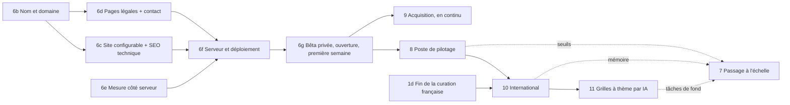

# 🗺️ Roadmap — Terminator

> Plan de complétion du projet. Document vivant : chaque phase correspond à un **Milestone GitHub**, chaque point à une ou plusieurs **issues**.
> Dernière mise à jour : septembre 2026.

## État d'avancement

| Phase | État |
|-------|------|
| 0a — Stabilisation | ✅ PR #2 (génération réparée, tests, benchmark) |
| 0b — Sécurité | ✅ PR #3 |
| 0c — Documentation et GitHub | ✅ PR #31, puis ruff et couverture en CI (#53), dépendances figées et pip-audit (#52), vulnérabilités transitives de Next.js (#54), captures d'écran dans le README |
| 1a — Pipeline du lexique | ✅ PR #42 |
| 1b — Curateur (+ motivation, usage hors du Wi-Fi) | ✅ PR #43 et #44 ; tri en cours (`data/lexicon/decisions.csv`). **Sa fin, mesurée ([1d](#1d-fin-de-la-curation-française--préalable-à-la-phase-10)), conditionne la Phase 10** |
| 1c — Lexique curé chargé par l'API | ✅ PR #46 : export et rechargement automatiques tous les 500 mots triés |
| 2 — Catalogue de layouts | ✅ format v1 (#12, [ADR 0006](adr/0006-format-des-layouts.md)), validateur et `GET /api/layouts` (#13), éditeur dans le curateur (#14) ; reste à recopier des layouts (#15) |
| 3 — Moteur avec mots imposés | ✅ critère atteint : **les 21 layouts du catalogue réussissent 20/20**. Pools de mots (#17), mots obligatoires (#18), redémarrages (#19), index des candidats (#20), validation croisée (#57), seuil du forward checking (#61), plafond de candidats à 300, dictionnaires thématiques ; contrat accepté ([ADR 0007](adr/0007-contrat-de-generation.md), #16). Tri par fréquence mesuré et **désactivé par défaut** : il ramène les mots absents des corpus de 33 % à 17 % mais fait tomber sept layouts sous le critère ([mesures](../backend/benchmarks/README.md)) — activable par requête. **Réserve levée, et elle révèle un problème** : la baseline comporte désormais des cas avec mots obligatoires (`--must-words`). Un mot imposé fait tomber le succès à 96 %, **trois le font tomber à 40 %**, tous layouts sous le critère ([mesures](../backend/benchmarks/README.md)). Le changement de layout (#73) améliore le cas où un format compte plusieurs layouts — 6×7 de 6/20 à 11/20 — sans rien résoudre sur le fond. **Traité non par le taux mais par l'aveu** : l'écran annonce la difficulté avant de générer ([ADR 0009](adr/0009-annoncer-la-difficulte.md)), et la mesure a désigné le vrai facteur — la **longueur** des mots imposés, pas leur nombre (#73 reste ouverte). Reportés en Phase 4 : `target_wish_ratio` et `layout_id`, qui n'ont de sens qu'avec la saisie |
| 4 — UX : génération et clarté | 🚧 en cours : écran de génération (#23) — liste de mots ordonnée, obligatoires/souhaités, dictionnaires thématiques, difficulté annoncée pendant la saisie, refus expliqués, provenance colorée. Reportés faute de `layout_id` : choix du layout et rejeu d'un seed (#89). page d'accueil (#22), audit UX (#21), sauvegarde des grilles (#24), parcours et accessibilité en CI (#25). Restent la recherche (#83) et la session d'utilisabilité avec un pair (#90) |
| 5 — Rendu professionnel | ✅ flèches et cases définitions (#26), saisie des définitions et export PDF (#27), retouche manuelle d'une grille ([ADR 0012](adr/0012-grille-modifiable.md)) |
| 6 — Durcissement et lancement public | 🚧 **6a durcissement** ✅ : cible d'hébergement choisie sur mesures ([ADR 0013](adr/0013-cible-hebergement-production.md)) et prérequis faits (gunicorn, places de génération, rate limiting derrière Cloudflare, lexique préparé au chargement). Faits aussi : export statique du frontend, sauvegardes, revue des licences, e-mails du compte ([ADR 0014](adr/0014-emails-du-compte.md)), session en cookies httpOnly ([ADR 0015](adr/0015-session-en-cookies.md)). CSP stricte par empreinte (#99). Suivi des erreurs (Sentry) prêt, inactif sans DSN. Journaux structurés (JSON en production). Audit ASVS fait ([AUDIT-SECURITE.md](AUDIT-SECURITE.md)). **Reste le lancement du site français** (6b à 6g) : nom et domaine, site configurable et référencement technique, pages légales et contact, mesure côté serveur, serveur et déploiement (#29), bêta privée puis ouverture |
| 7 — Passage à l'échelle | ⏳ pas avant que les mesures sur le VPS le demandent (#30). Trois déclencheurs s'y ajoutent : les seuils du poste de pilotage, la RAM d'une nouvelle langue, les appels à l'IA |
| 8 — Poste de pilotage | ⏳ juste après l'ouverture : espace d'administration, tendances, temps passé, alertes ([ADR 0016](adr/0016-mesure-d-usage-sans-cookie.md)) |
| 9 — Acquisition | ⏳ en continu dès l'ouverture : contenus, moteurs de recherche et de réponse IA |
| 10 — International | ⏳ après la fin de la curation française : un site par langue, anglais puis allemand puis espagnol ([ADR 0017](adr/0017-un-site-par-langue.md)) |
| 11 — Grilles à thème par IA | ⏳ après l'international : mots du thème et définitions proposés par l'IA, offre payante |

Décision du 14/09/2026 : **pas de déploiement en ligne** avant un serveur de production ([ADR 0004](adr/0004-pas-de-deploiement-en-ligne.md)). Le serveur visé est choisi depuis le 22/09/2026 ([ADR 0013](adr/0013-cible-hebergement-production.md)).

Décisions du 24/09/2026 :
- le site français ouvre **directement sur le VPS**, sans hébergement intermédiaire sur l'ordinateur de l'auteur ;
- **un site et un nom descriptif par langue**, Terminator restant le nom du moteur ([ADR 0017](adr/0017-un-site-par-langue.md), [ADR 0018](adr/0018-nom-du-site-francais.md)) ;
- **une mesure d'usage côté serveur, sans cookie ni script tiers** ([ADR 0016](adr/0016-mesure-d-usage-sans-cookie.md)) ;
- après l'ouverture et le poste de pilotage, l'ordre est fixé : **finir la curation française, puis l'international, puis les grilles à thème**.

## Contexte

Terminator est un outil personnel de création de **mots fléchés d'aspect professionnel français**. Cible future : créateurs expérimentés et professionnels. La mise en production se prépare (Phase 6), et les pratiques d'ingénierie sont déjà au niveau production.

- **Création manuelle** (recherche par motif) : ~90 % terminée.
- **Création automatique** : choisir une mise en page (layout), fournir des mots **obligatoires**, des mots **souhaités** et des **dictionnaires thématiques** (~30 % des mots de la grille), le reste provenant du dictionnaire commun. C'est le gros du travail restant.
- **Layouts** : recopiés à la main depuis de vrais livres de mots fléchés (6×7 et 11×6 pour l'instant).
- **Dictionnaire** : beaucoup trop large. `dela_clean.csv` contient 714 k mots distincts (~393 k de 11 lettres ou moins), sans définitions, avec énormément de formes fléchies rares. Cela dégrade la qualité des grilles **et** la vitesse du solveur.
- **Exigences** : UX irréprochable et auto-explicative ; sécurité (la base accepte des écritures utilisateur) ; projet relu prochainement par un pair → documentation et GitHub clairs et à jour.
- **Futur** : la mise en file d'attente des générations côté API risque de ne pas tenir la charge. Un moteur côté client est une piste → garder le moteur portable dès maintenant.
- **Ouverture et au-delà** (septembre 2026) : le site français ouvre sur le VPS sous un nom français (Phase 6). Viennent ensuite le poste de pilotage (8), l'acquisition (9), d'autres langues (10) et une offre payante de grilles à thème (11).

### Problèmes identifiés dans le code (septembre 2026)

- `backend/routes.py` appelle `GridGenerator` sans le `prebuilt_trie` requis → la génération depuis l'UI est cassée.
- Le frontend propose des tailles pour lesquelles aucun layout n'existe.
- Aucun timeout du solveur, aucun test du moteur.
- Le secret JWT est lu depuis la mauvaise variable d'environnement ; `logging` non importé dans `routes.py`.
- La recherche dans les mots personnels injecte la saisie brute dans un `LIKE` SQL (`%` / `_` agissent comme jokers).
- Pas de validation d'entrées par schéma, pas de rate limiting.
- Identifiants de dev en dur dans `docker-compose.yml`.
- Fichiers `__pycache__`, `.DS_Store` et `report.html` versionnés.

---

## Standards transverses (dès le premier jour)

**Ingénierie**
- **Git** : branches de fonctionnalité + PR même en solo, commits conventionnels, `main` toujours vert.
- **CI** : backend `ruff` (lint + format), `mypy` (moteur, curateur), `pytest` + couverture (≥ 70 % sur `engine/` et le pipeline lexique) ; frontend `eslint`, `tsc --noEmit`, `next build`, tests Playwright.
- **Sécurité en CI** : `pip-audit`, `pnpm audit`, CodeQL, Dependabot, gitleaks. *État au 24/09/2026 : seuls `pip-audit` et Dependabot sont en place. CodeQL n'est pas offert sur un dépôt privé en offre gratuite (voir 6f).*
- **Outillage local** : pre-commit identique à la CI (*pas encore en place*) ; `Makefile` (`setup`, `test`, `lint`, `harness`, `lexicon-build`, `curator`) ; `.env.example`.
- **Décisions** : ADR dans `docs/adr/` pour chaque choix structurant.
- **Données** : jeux de données externes téléchargés par script (versions et checksums figés), jamais versionnés. Les *décisions* de l'auteur sont versionnées. Les artefacts générés sont reconstruits.
- **Portabilité du moteur** : `backend/engine/` reste pur — aucun import Flask/BDD, déterministe pour un seed donné, contrat JSON en entrée/sortie, aucune I/O fichier dans le solveur. Condition pour un futur moteur Web Worker / WASM (Phase 7).

**Clavier (AZERTY français)**
- Raccourcis : flèches, Espace, Entrée, Retour arrière. Jamais de touches nécessitant Maj ou AltGr.

**UX**
- Chaque écran répond à : *qu'est-ce que c'est ? que puis-je faire ici ? que se passe-t-il ensuite ?*
- Textes en français cohérent, états vides utiles, messages d'erreur qui disent quoi faire.
- Indicateur de chargement pour toute action > 300 ms.
- Responsive et accessible (WCAG AA : contraste, focus, navigation clavier).

**Sécurité**
- Chaque endpoint valide ses entrées par schéma. Chaque ressource est limitée à son propriétaire. Rien ne fait confiance au client.

---

## Phase 0 — Stabiliser, sécuriser, être prêt pour la relecture

### 0a. Stabilisation
1. Hygiène : `.gitignore` (pycache, .DS_Store, report.html, test-results, venv) et retrait de ces fichiers de l'index.
2. Réparer `/api/grids/generate` (réutiliser `current_app.dela_trie` comme Trie pré-construit) ; chemins des templates relatifs au module.
3. Budget temps/nœuds dans le solveur, avec réponse d'erreur claire.
4. Config : `JWT_SECRET_KEY` lu correctement ; refus de démarrer en production avec des secrets par défaut ou sans `DATABASE_URL` ; import de `logging` ; identifiants docker-compose dans `.env`.
5. **Tests du moteur** sur mini-dictionnaires et mini-layouts : `SlotFinder`, `DictionnaireTrie.search_pattern`, `WordRepository`, solveur sur 4×4, chargement de template, smoke test de l'API `/generate`.
6. **Benchmark reproductible** : `test_harness.py` avec seeds fixes par layout, sortie JSON (taux de succès, temps p50/p95, backtracks) et baseline versionnée.

### 0b. Sécurité de base
1. **Validation des entrées** par schéma sur chaque endpoint : email en minuscules, longueur minimale du mot de passe, noms de dictionnaire (1–100 caractères sûrs), mots (lettres, accents, tiret, apostrophe, 2–30 caractères), définitions ≤ 255, masques (lettres et `?`, ≤ 30), tailles de grille et de listes plafonnées. Erreurs 400 explicites.
2. **Corriger l'injection `LIKE`** : échapper `%`, `_` et `\` avant de convertir `?` en `_`.
3. **Tests d'autorisation** : l'utilisateur B reçoit 404 sur tous les dictionnaires et mots de l'utilisateur A.
4. **Limites anti-abus** : Flask-Limiter sur login/register, recherche, génération ; plafonds de dictionnaires et de mots ; plafond de résultats *pendant* le parcours du Trie.
5. **Erreurs et en-têtes** : gestionnaire d'erreurs global sans stack trace ; debug désactivé hors dev ; en-têtes CSP, HSTS, X-Content-Type-Options, frame-ancestors ; CORS strict.
6. **Authentification** : endpoint de refresh token ; le frontend rafraîchit puis déconnecte sur 401 ; suppression réelle des données dans `delete_self`.
7. `docs/SECURITY.md` : modèle de menace léger, procédure de signalement, checklist OWASP ASVS allégée.

### 0c. Documentation et GitHub
- **README** réécrit : ce qu'est Terminator et pour qui, captures d'écran, fonctionnalités et état, démarrage en 5 minutes, carte du dépôt, badges CI.
- **`docs/`** : `ARCHITECTURE.md` (diagramme mermaid), `ENGINE.md` (slots, MRV, forward checking, nogoods, benchmark), `LEXICON.md`, `LAYOUTS.md`, `SECURITY.md`, `ROADMAP.md`, `adr/`. Mise à jour du `PRD.md` ; `READMESDD.md` et `amelioration-generate.md` fusionnés ou archivés.
- **`CONTRIBUTING.md`** et **`CLAUDE.md`** : workflow, tests, conventions.
- **GitHub** : un Milestone par phase, issues issues de ce plan, Project board, templates de PR et d'issues (bug, fonctionnalité, soumission de layout), labels, description et topics, protection de `main`, CHANGELOG, tag `v0.1.0`.

**Terminé quand** : la génération fonctionne depuis l'UI ; CI verte sur tous les contrôles ; tests d'autorisation et de validation au vert ; un nouveau venu comprend et lance le projet en moins de 15 minutes.

---

## Phase 1 — Curation du lexique

### 1a. Pipeline de données — `tools/lexicon/`
- **Sources** : DELA brut, **Lexique 3.83** (fréquence, lemme, catégorie grammaticale), extrait du **Wiktionnaire** (kaikki.org / wiktextract) pour les définitions, `wordfreq` en secours.
- **Build** → `lexicon.sqlite` local (reconstructible, non versionné) : forme normalisée, formes affichées, longueur, fréquence (zipf), lemme, catégorie, définition, suggestion (garder / supprimer).
- **Unité de décision** = la forme normalisée (celle utilisée dans les grilles), avec toutes ses formes affichées.
- **Source de vérité** = `data/lexicon/decisions.csv` (`mot;decision;date`), versionné, en ajout seul avec annulation. Un mot supprimé le reste.
- **Conservation automatique** au-dessus d'un seuil de fréquence choisi.
- `make lexicon-build` produit le dictionnaire curé utilisé par le backend. Tests unitaires.

### 1b. Mini-app de curation — `tools/curator/` (séparée du produit)
- Petit backend Flask + **page mobile-first** installable (PWA), lancée sur l'ordinateur, accessible depuis le téléphone via le Wi-Fi.
- **Sécurité** : écoute sur le réseau local uniquement, PIN/token dans `.env`, écriture limitée à `decisions.csv` et au dossier des layouts, validation des chemins côté serveur.
- **Carte de tri** : mot, formes, définition, barre de fréquence, catégorie/lemme, badge de suggestion.
- **Touches (AZERTY)** : `←` supprimer, `→` garder, `↓` / `Retour arrière` annuler, `↑` passer, `Maj+←` supprimer le mot et toutes ses formes. Sur téléphone : glisser gauche/droite + gros boutons. Carte suivante instantanée, pas de confirmation, légende des touches visible.
- **File** : mots courts d'abord (2–8 lettres, ~131 k), les moins fréquents en premier ; filtres longueur / fréquence / motif.
- **Motivation** : compteur du jour, restant par longueur, série de jours.

### 1c. Bascule du produit sur le lexique curé
- Chargement du fichier curé derrière un flag de configuration ; définitions affichées dans la recherche ; fréquence utilisée par le générateur.

**Terminé quand** : 500+ mots triés en ~10 min sur téléphone, build reproductible, recherche et génération sur le lexique curé.

### 1d. Fin de la curation française — préalable à la Phase 10

L'international attend que le lexique français soit fini (décision du 24/09/2026). C'est aussi le critère « Qualité des mots » du [PRD](PRD.md), encore ❌.

**Où en est la curation au 24/09 :**
- 11 223 décisions effectives : 7 366 suppressions et 3 857 mots gardés, prises du 15 au 18/09 ;
- au 15/09, 119 974 mots de 8 lettres ou moins restaient à trier, avant les règles automatiques.

**Terminé quand** toutes ces conditions sont réunies et consignées dans [LEXICON.md](LEXICON.md) :
1. `make lexicon-stats` ne compte plus aucun mot à trier de 2 à 5 lettres, ni de 6 à 8 lettres ;
2. les mots de 9 lettres et plus sont réglés par des règles, pas un par un : la règle `flexions-rares-longues` est tranchée, et le mode d'export de production est fixé et documenté ;
3. `python -m tools.lexicon revision` ne renvoie plus rien ;
4. sur le lexique de production, le benchmark (21 layouts × 20 seeds) reste à 95 % de succès ou plus pour chaque layout ;
5. une nouvelle mesure, `unvouched_share`, reste à 5 % ou moins : c'est la part des mots placés que ni l'auteur ni la fréquence n'ont validés, c'est-à-dire ni gardés à la main ni gardés d'office. `unknown_share` reste rapportée (33,4 % aujourd'hui) ;
6. sur 20 grilles relues à l'aveugle, au moins 18 ne contiennent aucun mot que l'auteur juge impubliable ;
7. la taille du lexique et la mémoire de l'API après chargement sont notées : elles fixent le budget de la Phase 10.

Issues : #125 (critère de fin), #126 (avis de l'IA), et #127, un bug de normalisation des mots imposés à corriger en chemin.

**Accélérateur possible, à mesurer d'abord :** l'IA pourrait suggérer « garder » ou « supprimer » dans le curateur, à côté des autres indices.
- Ce serait une suggestion, **jamais une décision** ([ADR 0005](adr/0005-pipeline-du-lexique-et-decisions.md)).
- Avant tout usage, on mesure son accord avec les décisions déjà prises, comme pour les règles automatiques ([ADR 0008](adr/0008-regles-automatiques-et-revision.md)).
- Traité par lots, le coût se compte en dizaines de dollars.

---

## Phase 2 — Catalogue de layouts
Objectif : recopier vite et sans erreur les grilles trouvées dans des magazines et des cahiers, dans de nombreux formats.

1. **Format v1** adapté à l'AZERTY : `x` = case définition, `-` = case lettre (l'ancien `#`/`.` reste accepté ; script de conversion). Aucune métadonnée : le format se déduit de la grille, l'identifiant du chemin. `backend/layouts/<L>x<H>/<NNN>.txt`, numéro attribué automatiquement. Flèches non encodées (déduites de la géométrie en Phase 5). [ADR 0006](adr/0006-format-des-layouts.md).
2. **Validateur** (CLI + tests + CI) : taille conforme au dossier ; chaque case lettre appartient à un mot de ≥ 2 lettres ; grilles en double signalées ; statistiques des slots. Un mot peut commencer au bord.
3. **Éditeur de layouts** dans la mini-app : choisir L×H (n'importe quel format), cliquer/toucher les cases, validation en direct ; « Enregistrer » **écrit directement dans `backend/layouts/<L>x<H>/`** après validation serveur, sans jamais écraser. Duplication/édition d'un layout existant.
4. `GET /api/layouts` (formats + aperçus) ; les nouveaux layouts rejoignent automatiquement le benchmark.
5. **Plus tard (non planifié)** : prendre en photo une grille ; le logiciel reconnaît les cases et propose la grille dans l'éditeur, où l'auteur corrige et valide ([#47](https://github.com/maximefd/terminator-app/issues/47)).

---

## Phase 3 — Moteur de génération avec mots imposés
**Contrat d'API** (ADR d'abord ; c'est aussi le futur contrat côté client) :
- Entrée : `layout_id` ou `format`, `must_words[]`, `wish_words[]`, `wish_dictionary_ids[]`, `target_wish_ratio` (0.3 par défaut), `seed`, `time_budget_ms`.
- Sortie : grille, mots placés avec leur source (`must` / `wish` / `common`), ratio atteint, mots obligatoires non placés avec la raison, statistiques.

**Moteur** :
1. Pools de mots dans `WordRepository` : commun (curé), souhaités (saisis + dictionnaires thématiques), obligatoires.
2. **Mots obligatoires** : vérification préalable des longueurs ; placement en premier (le plus contraint d'abord, avec backtracking) ; en cas d'échec, explication plutôt qu'une erreur 500.
3. **Mots souhaités** : tri des candidats par pool, puis fréquence, puis score de lettres ; ratio visé en objectif souple via **redémarrages aléatoires** dans le budget temps.
4. **Mots communs** : tri par fréquence des candidats (l'échantillon aléatoire de 30 k mots a déjà été supprimé en Phase 0a : il rendait presque toute génération impossible).
5. **Redémarrages aléatoires** : la baseline montre un profil « vite ou jamais » (11×6 : 3/20 en 20 s, grilles réussies en 3,6 à 15,7 s) ; plusieurs trajectoires courtes dans le budget plutôt qu'une longue. Voir `backend/benchmarks/README.md`.
5. **Performance** guidée par le benchmark : index des candidats par (position, lettre), invalidation ciblée du cache.
6. Tests : mot obligatoire placé, impossibilité expliquée, ratio rapporté, même seed ⇒ même grille.

**Terminé quand** : ≥ 95 % de succès dans le budget pour chaque layout du catalogue.

---

## Phase 4 — UX : génération et clarté globale

**État de départ (septembre 2026)** : l'écran de génération se limite à un menu de format et un bouton. Tout ce que
la Phase 3 a construit — mots obligatoires, dictionnaires thématiques, tri par fréquence, provenance des mots,
ratio atteint — existe côté API mais **n'est visible nulle part dans l'interface**. C'est l'objet de cette phase.

**Prérequis backend** : « choix du layout avec aperçus » demande `layout_id` dans la requête de génération
(`GET /api/layouts` fournit déjà les aperçus). Avec `target_wish_ratio`, ce sont les deux derniers champs du
contrat de l'[ADR 0007](adr/0007-contrat-de-generation.md) restant à implémenter.

- **Audit UX** ✅ (#21) des pages existantes et corrections : [docs/AUDIT-UX.md](AUDIT-UX.md) liste friction par friction ce qui a été corrigé, et ce qui ne l'est pas avec son issue (#78, #79).
- **Page d'accueil** ✅ (#22) : trois blocs avec un exemple **vrai** chacun (le motif `P??LE` et ses résultats réels, une grille produite par le moteur), appel à l'action, mode invité explicité. La recherche par motif a déménagé de `/` à `/search`, et les dictionnaires personnels ont leur page `/dictionaries` au lieu d'une colonne visible seulement une fois connecté.
- **Aide intégrée** ✅ : motifs d'exemple cliquables (`P??LE`), obligatoire contre souhaité expliqué sous la liste de mots, états vides qui disent quoi faire (#21, #22).
- **Écran de génération** ✅ (#23) : liste de mots ordonnée par glisser-déposer, bascule obligatoire / souhaité, sélection des dictionnaires thématiques, difficulté annoncée pendant la saisie, refus expliqués cause par cause, grille avec source des mots colorée et ratio atteint. **Reportés** : choix du layout avec aperçus et rejeu d'un seed — ils demandent `layout_id`, et l'auteur a écarté le choix du layout pour l'instant.
- **Sauvegarde des grilles** ✅ (#24) : modèle `SavedGrid`, migrations Alembic ([ADR 0010](adr/0010-migrations-de-schema.md)) et page « Mes grilles ». La grille est conservée telle que produite, pas rejouée : le lexique bouge, la seed ne suffit pas à la retrouver.
- **Recherche (derniers 10 %)** ([#83](https://github.com/maximefd/terminator-app/issues/83), seul point de la phase encore ouvert) : lettres incluses/exclues, filtre de longueur, définitions.
- Tests Playwright et contrôle d'accessibilité axe en CI ✅ (#25) : travail `e2e-ci` (PostgreSQL + API + parcours + axe sur chaque écran). **Reste à faire** : la session d'utilisabilité avec un pair, qui ne s'automatise pas.

## Phase 5 — Rendu professionnel
- **Flèches et cases définitions** ✅ (#26) : déduites de la géométrie (`engine/arrows.py`), rendu SVG, bascule solution / grille vierge. Vérifié sur tout le catalogue : aucun mot sans case de définition, deux définitions par case au plus, jamais deux du même côté.
- **Saisie des définitions** ✅ (#27) : écran `/grids/edit?id=<id>`, une définition par mot, enregistrée au fil de la frappe.
- **Export** ✅ (#27) : PDF vectoriel dessiné depuis le SVG de l'écran, solution en seconde page, et fichier de travail JSON.
- **Retouche d'une grille conservée** ✅ ([ADR 0012](adr/0012-grille-modifiable.md)) : corriger une lettre à la main, mots recalculés, propositions qui respectent les croisements, mots hors lexique signalés et rangeables d'un clic dans un dictionnaire.
- **Grilles conservées à l'échelle** ✅ : recherche, filtres (format, état, archivées), tri, bloc-notes par grille.
- **Reste** : l'impression directe (mise en page A4 multi-grilles) et la relecture d'un fichier de travail, si le besoin s'en fait sentir.

## Phase 6 — Durcissement et lancement public

**Objectif** : ouvrir le site français à tous, sur le VPS et sous son nom, avec des pages légales vraies et des mesures dès la première visite.

### 6a. Durcissement ✅
- **Cible d'hébergement** ✅ ([ADR 0013](adr/0013-cible-hebergement-production.md)) : un VPS OVH derrière Cloudflare (~65 € par an), choisi sur mesures. Prérequis faits :
  - clé du rate limiting derrière le tunnel ;
  - gunicorn ;
  - places de génération ;
  - lexique préparé au chargement ;
  - rechargement à chaud coupé en production ;
  - export statique du frontend.
- **Faits aussi :**
  - cookies httpOnly + CSRF au lieu de localStorage ✅ ([ADR 0015](adr/0015-session-en-cookies.md)) ;
  - Postgres uniquement en production ✅ (refus de démarrer sans `DATABASE_URL`) ;
  - sauvegardes ✅ (`make db-backup`) ;
  - Sentry ✅ (inactif sans DSN) ;
  - logs structurés ✅ (JSON en production) ;
  - audit ASVS ✅ ([AUDIT-SECURITE.md](AUDIT-SECURITE.md)) ;
  - revue des licences ✅ ([LICENCES.md](LICENCES.md)).
- **Écartés** (24/09/2026) :
  - les **migrations jouées au déploiement**, séparément du démarrage. Avec un seul serveur, gunicorn charge l'application une fois avant de créer ses workers : les migrations ne se jouent qu'une fois ([ADR 0013](adr/0013-cible-hebergement-production.md)) ;
  - un **environnement de staging** : un second serveur doublerait le budget. La pile isolée des tests locaux (API, PostgreSQL et Mailpit jetables) en tient lieu.

### 6b. Nom et domaine (#110, #111)
- **Le nom :** **Le Fléchoir**, sur `leflechoir.fr` ([ADR 0018](adr/0018-nom-du-site-francais.md)). Reste la vérification des marques avant l'achat. Terminator reste le nom du moteur ([ADR 0017](adr/0017-un-site-par-langue.md)).
- **Le domaine :** `leflechoir.fr` acheté avec renouvellement automatique (et `leflechoir.com` pour rediriger, si possible). La zone Cloudflare sert `leflechoir.fr` (le site) et `api.leflechoir.fr` (le tunnel) ; l'hôte canonique est fixé une fois pour toutes.
- **Les e-mails :**
  - `no-reply@` par Brevo, avec SPF, DKIM et DMARC ;
  - `contact@` et `securite@` par Cloudflare Email Routing.
- **Les réglages de la zone :**
  - robots des moteurs de recherche et de réponse IA autorisés : ils sont bloqués par défaut sur une nouvelle zone depuis juillet 2025 ;
  - Bot Fight Mode coupé sur `api.` : ses défis cassent `fetch` ;
  - Web Analytics de Pages coupé : la CSP bloquerait son script ;
  - géolocalisation IP active, pour `CF-IPCountry`.
- **La sécurité des comptes :** double facteur et codes de secours sur Cloudflare, OVH, le registrar, GitHub et Brevo. Cloudflare concentre à lui seul le DNS, Pages, le tunnel, R2 et le courrier.

### 6c. Site configurable et référencement technique (#112, #113)
- **Configuration du site**, lue au build : nom, URL, langue, contacts, URL de l'API.
  - `SITE_NAME` pour les e-mails.
  - Plus aucun « Terminator » visible.
  - Le message d'erreur réseau ne cite plus `make dev-api`.
- **Mise en page racine côté serveur** : métadonnées communes, modèle de titre, `metadataBase`.
- **Balises et fichiers :**
  - `robots.txt`, `sitemap.xml`, canonical, image de partage, favicon et manifest ;
  - pages privées en `noindex`, jamais en `Disallow` ;
  - page 404 en français ;
  - un test Playwright des balises.

### 6d. Pages légales, contact et vie privée (#114, #115)
- **Pages réécrites :** mentions légales, confidentialité, CGU et crédits. Elles couvrent l'éditeur, les hébergeurs, les sous-traitants, la mesure ([ADR 0016](adr/0016-mesure-d-usage-sans-cookie.md)), les durées de conservation et le droit d'opposition. Plus aucun lien vers GitHub : le dépôt devient privé.
- **Contact et sécurité :**
  - une page contact avec l'adresse `contact@` ;
  - un `security.txt` avec `securite@` ;
  - `SECURITY.md` et le modèle d'issue mis à jour.

  Le formulaire vient en Phase 8.
- **Données personnelles :** un registre des traitements, des durées de conservation, et la rotation des journaux Docker.

### 6e. Mesure côté serveur dès le premier jour (#116)
- **Événements d'usage** ([ADR 0016](adr/0016-mesure-d-usage-sans-cookie.md)) :
  - générations : format, mots imposés, issue, durée, temps CPU ;
  - recherches, comptes, erreurs, refus « occupé ».

  Le visiteur est une empreinte quotidienne, jamais une adresse IP. Chaque événement porte `lang` et le site.
- **Comptes :** `created_at` et `last_login_at`.
- **Lecture :** par `flask stats` sur le serveur. La page web vient en Phase 8.

### 6f. Serveur, déploiement et exploitation (#29 : #117 à #120 ; #121, #122)
- **Image et compose de production :**
  - gunicorn non-root, avec healthcheck ;
  - PostgreSQL sans port publié ;
  - cloudflared ;
  - `.dockerignore`, rotation des journaux, Dependabot pour Docker.
- **Lexique de lancement :**
  - mode d'export choisi sur le benchmark complet ;
  - fichier sans définitions ;
  - livré comme artefact avec empreinte, ou construit sur le serveur.
- **Serveur et déploiement :**
  - VPS : SSH par clé, mises à jour automatiques ;
  - `make deploy`, avec test de fumée, retour arrière et runbook ;
  - Pages sur le domaine propre ;
  - Sentry (projets UE) et UptimeRobot.
- **Sauvegardes :** nocturnes et chiffrées, copiées sur R2, avec une restauration vérifiée chaque mois.
- **CI sur l'export statique :** aujourd'hui, la CSP n'est testée que contre `next dev`.
- **Dépôt privé :**
  - ce qu'on perd sur GitHub Free : protection de branche, CodeQL, signalement privé des failles, minutes d'Actions ;
  - comment le compenser ;
  - une alternative : code public et données privées.

### 6g. Bêta privée, ouverture, première semaine (#123, #124)
- **Bêta privée :** le premier déploiement de production passe derrière Cloudflare Access, pour quelques testeurs et la session d'utilisabilité (#90). Ce jour-là, l'ADR 0004 est marquée « remplacée par 0013 ».
- **Avant d'ouvrir :**
  - checklist de [SECURITY.md](SECURITY.md) à 14/14 ;
  - contrôle ASVS sur l'adresse publique ;
  - `.env` et clé `age` hors du serveur.
- **Ouverture :** Access retiré, Search Console et Bing, sitemap soumis.
- **Première semaine :** `load_profile.py` sur le VPS, puis lecture des seuils de l'ADR 0013, pour décider du passage au VPS-2.

**Terminé quand :**
- le site est ouvert sur son domaine ;
- la checklist est à 14/14 ;
- une sauvegarde de la nuit a été restaurée depuis R2 ;
- les événements sont collectés depuis la première visite ;
- un message de test est bien arrivé à `contact@` ;
- Search Console est validée.

## Phase 7 — Décision de passage à l'échelle : file serveur ou moteur client
- **Déclencheurs** :
  - les seuils de l'[ADR 0013](adr/0013-cible-hebergement-production.md), lus dans le poste de pilotage : RAM au-delà de 75 %, refus « occupé » fréquents, p95 au-delà de 15 s ;
  - une nouvelle langue qui ne tient plus en mémoire (Phase 10) ;
  - les appels à l'IA de la Phase 11 : ils attendent le réseau, et ne doivent pas occuper les workers synchrones.
- **Spike + ADR** comparant :
  - (a) une file de jobs serveur (RQ/Celery + Redis) ;
  - (b) un **moteur côté client** : portage TypeScript ou Rust→WASM dans un Web Worker, lexique compressé DAWG/FST ;
  - (c) un hybride.

  Pour les seuls appels à l'IA, une table de tâches dans PostgreSQL (`SKIP LOCKED`) peut suffire, sans Redis.
- **Prérequis déjà prévus** : moteur pur et déterministe, contrat JSON, benchmark pour vérifier l'équivalence, lexique curé compact.

## Phase 8 — Poste de pilotage

**Objectif** : répondre d'un coup d'œil aux questions de l'auteur ([ADR 0016](adr/0016-mesure-d-usage-sans-cookie.md)) : qui vient, ce qu'on génère, ce qui casse, ce que consomme le serveur. Issues : #128 à #132.

- **Espace d'administration :**
  - `is_admin` posé en ligne de commande, sur une adresse confirmée ;
  - `/api/admin/*` répond 404 à tout autre compte ;
  - accès journalisés et tests d'autorisation ;
  - page `/admin` liée nulle part, en `noindex`.

  Renfort possible : Cloudflare Access ou un second facteur.
- **Tableaux :**
  - visiteurs et comptes ;
  - générations par format et par issue, selon le nombre ou la longueur des mots imposés (nourrit #73) ;
  - mots imposés absents du lexique (nourrit la curation) ;
  - parcours : visite → recherche ou génération → grille conservée → compte ;
  - erreurs par route, refus « occupé » ;
  - temps CPU, RAM, dernière sauvegarde ;
  - sources, dont les moteurs de réponse IA ;
  - pays et langues des navigateurs (éclairent la Phase 10).
- **Balise sans cookie** : pages vues, temps passé, exports PDF, dans les conditions de la CNIL ([ADR 0016](adr/0016-mesure-d-usage-sans-cookie.md)).
- **Échantillons système** : un par minute, gardés 30 jours. Agrégats quotidiens, et purge à 13 mois.
- **Contact :**
  - un formulaire ;
  - « Signaler ce problème » après une erreur, avec l'identifiant de requête ;
  - une boîte de réception ;
  - des notifications plafonnées : le quota gratuit de Brevo, 300 e-mails par jour, est partagé avec les e-mails du compte.
- **Alertes par e-mail** (seuils de l'ADR 0013, pic d'erreurs 500, sauvegarde manquante) et bilan hebdomadaire.

**Terminé quand** : chaque question de l'auteur trouve sa réponse sur `/admin`, sans passer par le serveur.

## Phase 9 — Acquisition

En continu dès l'ouverture, en parallèle de la curation. Issues : #133, #134.

- **Pages de contenu**, chacune avec une vraie grille produite par le moteur :
  - créer une grille de mots fléchés ;
  - grilles personnalisées : anniversaire, mariage, départ, classe ;
  - mots fléchés ou mots croisés ;
  - une FAQ ;
  - des données structurées (JSON-LD).
- **Moteurs de réponse IA :**
  - des contenus faciles à citer et un `llms.txt` ;
  - une présence sur des sites tiers : forums, associations, annuaires ;
  - le suivi des visites venant de ChatGPT, Perplexity ou Copilot dans le poste de pilotage.
- **Suivi** : Search Console et Bing (requêtes, positions, pages indexées).
- **À évaluer** : des pages « mots de N lettres » tirées du lexique. Le potentiel est fort, mais le contenu risque d'être mince et le build plus lourd.

**Terminé quand** : jamais, c'est une piste continue. On la juge, mois après mois, sur les visites venues des moteurs.

## Phase 10 — International

Elle commence après la fin de la curation française ([1d](#1d-fin-de-la-curation-française--préalable-à-la-phase-10)), avec un site par langue ([ADR 0017](adr/0017-un-site-par-langue.md)).

- **10a Socle** (#135, #136) :
  - configuration par site ;
  - catalogues de textes, messages de l'API par code ;
  - `lang` dans l'API, les grilles et les dictionnaires ;
  - une seule normalisation, paramétrée par la langue ;
  - alphabet par langue : scores des lettres, retouche, saisie, Ñ ;
  - tables de difficulté par langue ;
  - layouts rattachés à une tradition ;
  - pipeline du lexique par langue : sources, licences, fréquences.

  Trois décisions l'attendent : la forme de l'API multi-site (un conteneur par site par défaut), le budget mémoire (représentation compacte ou VPS-2), et des comptes communs ou séparés.
- **10b Anglais** (*arrowords* britanniques, #137), en **pilote**, avec un go/no-go avant la suite. L'Allemagne est sans doute le plus grand marché : les pays et les langues mesurés depuis l'ouverture diront si l'anglais doit vraiment passer en premier.
- **10c Allemand** (*Schwedenrätsel*, #138) : Ä, Ö et Ü s'écrivent AE, OE et UE, ß s'écrit SS ; grands formats ; Impressum.
- **10d Espagnol** (*autodefinidos*, #139) : Ñ comme 27e lettre.

Chaque langue demande :
- un nom et un domaine ;
- un lexique relu par un locuteur natif ;
- des layouts du pays ;
- des contenus et des pages légales du pays.

**Terminé quand**, pour chaque langue :
- le site est en ligne ;
- le benchmark atteint 95 % ou plus pour chaque layout ;
- un échantillon du lexique a été relu par un locuteur natif.

## Phase 11 — Grilles à thème par IA (offre payante)

**Le principe** : une grille ultra-personnalisée.
1. L'utilisateur décrit un thème.
2. L'IA propose des mots.
3. Le moteur construit la grille.
4. L'IA propose les définitions.
5. L'utilisateur retouche, puis imprime.

- **11a Spike et évaluation** (#140) : deux tâches, les mots du thème et des définitions au style mots fléchés qui tiennent dans une case.
  - Modèle : Claude Opus 5 par défaut, à 5 $ par million de jetons en entrée et 25 $ en sortie. Le raisonnement se facture en sortie.
  - Coût estimé : de 0,15 à 0,45 $ par grille de 60 mots. À mesurer, en essayant d'abord un effort plus bas.
  - Un test d'intérêt peut commencer plus tôt : une liste d'attente, mesurée dans le poste de pilotage.
- **11b Prérequis :**
  - des mots imposés fiables (#73) ;
  - `target_wish_ratio` ;
  - des noms propres acceptés comme mots imposés ;
  - des appels à l'IA en tâche de fond, sans occuper les workers synchrones (Phase 7). Un appel prend 10 à 60 s, et Cloudflare coupe une requête au bout de 100 s.
- **11c Offre** (#141) :
  - statut de micro-entreprise et identité complète de l'éditeur ;
  - CGV ;
  - TVA dans plusieurs pays : prestataire « marchand officiel », ou guichet OSS ;
  - médiateur de la consommation ;
  - renonciation expresse au droit de rétractation pour un contenu numérique ;
  - prix à la grille, ou abonnement.
- **11d Parcours** (#142) : thème → mots proposés et validés → génération → définitions proposées, retouchées dans l'éditeur → PDF prêt à imprimer.
  - Modération des thèmes.
  - Seul le texte du thème part chez le fournisseur d'IA, déclaré comme sous-traitant.
  - Les contenus générés sont signalés comme tels (transparence exigée par l'AI Act).
- **Piste :** une banque de définitions proposées pour les mots qui remplissent vraiment les grilles (50 000 à 100 000). Générée par lots pour moins de 100 $, elle serait proposée dans l'éditeur (voisin de #91).

**Terminé quand** : un vrai client a acheté une grille à thème, de bout en bout.

---

## Ordre et calendrier

Jusqu'au 24/09/2026 :
- la Phase 0, avant la relecture ;
- puis les Phases 1, 2 et 3 en parallèle ;
- puis les Phases 4, 5 et 6.

La suite :

1. **Avant l'ouverture, fin de la Phase 6.** D'abord **6b** : le nom fixe les cookies, les e-mails, la zone Cloudflare et le référencement. Puis 6c, 6d et 6e en parallèle, puis 6f et 6g.
2. **Juste après l'ouverture, la Phase 8.** Les événements s'accumulent depuis le premier jour ; le poste de pilotage les montre.
3. **En continu :**
   - la curation quotidienne (1d), jusqu'à son critère de fin ;
   - la Phase 9 ;
   - les issues ouvertes (#83, #89, #91, #73, #15).
4. **Une fois la curation terminée, la Phase 10.** L'anglais passe d'abord, comme pilote, puis l'allemand et l'espagnol. L'ordre se revoit avec les pays et les langues mesurés.
5. **Puis la Phase 11.**
6. **La Phase 7**, dès que l'un de ses déclencheurs se présente.
